# How to export a Simple Plane model to Google Earth Flight Simulation

I'm still playing SimplePlanes always, but not as you think. I have written a guide for how to plan a flight in Google Earth Flight Simulation.

[Flying a SR-22 through the great Valley Grand Canyon](https://aesuib.github.io/GoogleEarth/SR22flyingVally.html)


 Now, I want to try to export the Simple Planes model to Google Earth Flight Simulation. 

 As all of you know, there are only two planes you can choose from in Google Earth Flight Simulation.


Google Earth is not a open-source software, so, I think I could not develop anything for the simulation. Until I searched **f16** on my computer and found a file named **f16.acf** in the Google Earth directory, I found it written in plain text.

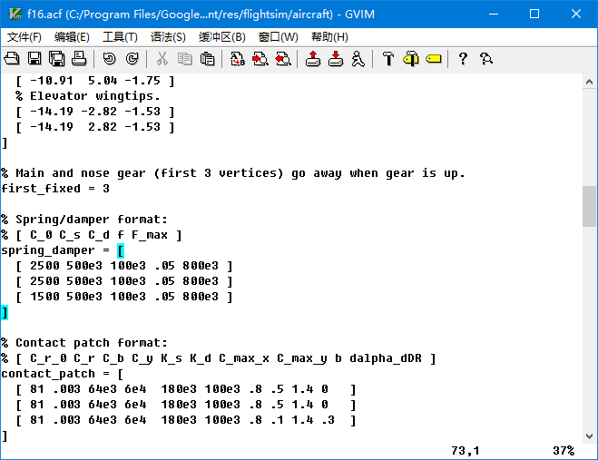

That means I could do something to it.

# Adding new models? No, just to modify the original model

Use `tree` command to show the structure of this flight simulation:

```bash
PS C:\Program Files\Google\Google Earth Pro\client\res\flightsim> tree /f
卷 系统 的文件夹 PATH 列表       
卷序列号为 64DA-4693
C:.
│  flightsim.ini
│  
├─aircraft
│      f16.acf
│      sr22.acf
│      
├─controller
│      generic.ini
│      genius_maxfighter_f16u.ini
│      logitech_attack3.ini      
│      logitech_extreme_3d.ini   
│      logitech_force_3d.ini
│      logitech_freedom.ini
│      saitek_cyborg_evo.ini
│      saitek_x52.ini
│      speed_link_black_hawk.ini        
│      speed_link_black_widow.ini       
│      speed_link_cougar_flightstick.ini
│      speed_link_dark_tornado.ini      
│      xbox_360.ini
│
├─hud
│      generic.ini
│      sr22.ini
│
├─keyboard
│      generic.ini
│      sr22.ini
│
└─planet
        earth.ini
```

It's very simple, **flightsim.ini** seems to be the root configuration file.


So, I added one choice of my plane here, to have a test. But, The GUI of Google Earth doesn't show any new choice. Also, I didn't find anywhere to add a photo and description of the item in the GUI,


The GUI of Google Earth is not open source, you can choose only the two original plane models. So, all the following work will be done on the original model, you must save the original flight simulation backup before any work.

# file structure


Folder **aircraft** includes flight dynamic model **.acf** files for every plane. It is the core configuration of a model

Folder **controller** includes **.ini** files for different controllers. But, GE FlightSimulation is not a complicated vivid flight simulation, I do not need a flight controller, and prefer to use a mouse and keyboard.

Folder **hud** includes **.ini** files for HUD of different planes. F16 use the **generic.ini**

Folder **keyboard** includes **.ini** files for flying with keyboard and mouse only, the default is ok

Folder **planet** includes **.ini** for parameters of the planet, for example, our Earth, but you can add configurations for Mars.

No cockpit? you can add a cockpit photo into GEFS in fact.

# Flight Dyanmic Model

The original models are convenient for most of the flights. But, there are two pain points.


## Hypersonic aircraft


One pain point is the long flight of the Intercontinental. I used to draw actual flight plans from Asia to America, The plan is perfect, but the flight is boring. There isn't an automated flight mode in GEFS, and it does not provide time acceleration, so, I have to control F16 for hours.

I need a hypersonic aircraft to fly anywhere on the earth in less than half an hour.

We have a common saying "力大砖飞" which means, Power enough brick can fly! So, I modified the f16.acf file:

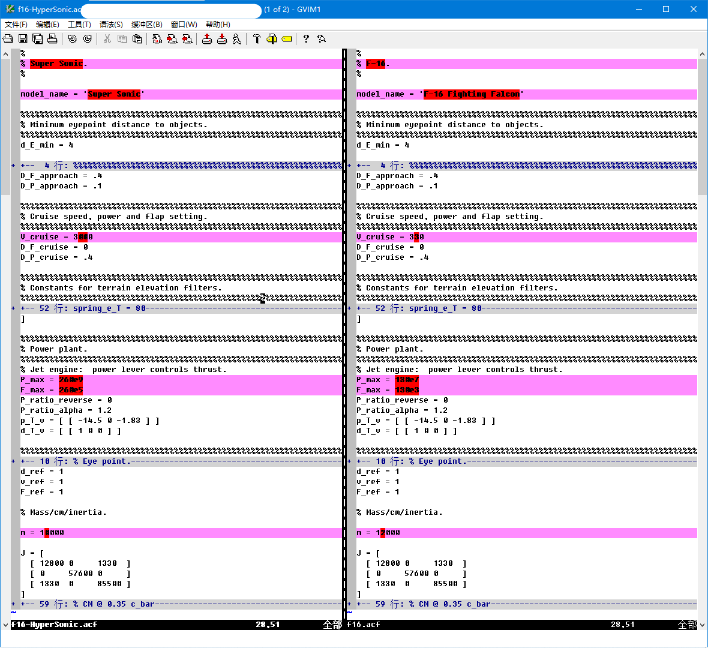

Increase the power and decrease the mass, this will make a F16 fly hypersonic!

[download the hypersonic f16 .acf file here](f16-HyperSonic.acf)

Then, rename to f16.acf and replace the original f16.acf, enjoy yourself!

// insert my video here

<iframe width="1280" height="708" src="https://www.youtube.com/embed/e5yWmni-MQU" title="Google Earth Pro FlightSimulation Hypersonic Aircraft Model" frameborder="0" allow="accelerometer; autoplay; clipboard-write; encrypted-media; gyroscope; picture-in-picture; web-share" allowfullscreen></iframe>

Pay attention! it flies very fast, so, you must control it gently, or GE will crash. To take off from the runway, minimum power is enough, and to land, decrease power to zero.

## low speed super maneuver helicopter

Another pain point is to view the terrain carefully, onboard an aircraft. The aircraft should fly very slowly, make turns very quickly, easy to take off and land anywhere. Just like what I fly in this:

[Flying a SR-22 through the great Valley Grand Canyon](https://aesuib.github.io/GoogleEarth/SR22flyingVally.html)


So, a helicopter is a good choice, but the original configurations are all fixed-wing aircraft. A lot of parameters should be modified in the .acf file to model a rotary-wings flight dynamic model.

I googled a long time and found them finally.

[New Flyable Planes for Google Earth](https://googleearthcommunity.proboards.com/thread/4186/new-flyable-planes-google-earth)

and this webpage link,

[Planes For Google Earth Flight Simulator](https://www.gearthblog.com/blog/archives/2009/08/planes_for_google_earth_flight_simu.html)

But the models on the second link are not available now, it's too old and the keyhole website has closed down. So, I downloaded all the models on the first link, and saved all in my space here:

| file | model |
| --- | ----|
| [f16 f35.acf](f16%20f35.acf) | F-35 |
| [f16 typhoon.acf](f16%20typhoon.acf) | Typhoon | 
| [f16 p51.acf](f16%20p51.acf) | P-51 |
| [f16 m2000.acf](f16%20m2000.acf) | Mirage-2000 |
| [f16 gripen.acf](f16%20gripen.acf) | Gripen |
| [f16 f15.acf](f16%20f15.acf) | F-15 |
| [f16 su27.acf](f16%20su27.acf) | Su-27 |
| [f16 crj900.acf](f16%20crj900.acf) | CRJ-900 |
| [f16 apache.acf](f16%20apache.acf) | Apache |

Among these models, there is a rotary-wing aircraft, Apache. Use the apache file to replace the sr22 fdm file, and then, enjoy yourself!

// insert my video here

<iframe width="1280" height="720" src="https://www.youtube.com/embed/hyznS3mmgqQ" title="" frameborder="0" allow="accelerometer; autoplay; clipboard-write; encrypted-media; gyroscope; picture-in-picture; web-share" allowfullscreen></iframe>

Pay attention! helicopter is difficult for a fixed-wing aircraft pilot to fly. 

> Remember that the landing gear on the aircraft are not retractable and should remain "out". Since helicopters do not have flaps, it is not necessary to use them when flying. For sharper turns, roll the aircraft while pressing 0 or Enter on the Number Pad, or Shift + right or left arrow keys to make use of the Anti Torque Pedals. To recenter the aircraft press C or 5 on the Number Pad. When landing, try slowly approaching the landing area while descending at a gentle and steady rate
> 
> Word of warning: Do not let the speed of this aircraft rise beyond 200 knots. Not only is this the realistic "do not exceed speed" for this aircraft, but if you fly it much faster, it will also cause Google Earth to become unresponsive, and might even crash your computer.

The FDM of the Apache has been changed a lot from the original F16:


You can modify it freely.

# Cockpit 2D

Expect the HUD, you can add a 2D cockpit to Google Earth Flight Simulation. Google Earth does support importing 3-D models, but 3D models will be located on the earth's surface, or move on a planned route on the earth, 3D models cannot be fixed overlay your screen, so, only a 2D snapshot of a cockpit can be used in GEFS. 

The 2D cockpit is not a real cockpit, the flight instruments on the dashboard do not work, It's just a picture, statically, overlaid on the view. But it is better than no cockpit, the cockpit dashboard will be shown bottom in the view window, with windshield frames left and right. 

Most importantly, the windshield glass should be transparent so that you can see through the overlay 2D cockpit picture, the Out-The-Window(OTW) view. You must view the terrain from inside the cockpit of an aircraft. So, the final picture should be in .png file format,  with the OTW part transparent.

Let's do it!

## Choose an aircraft for your flight task

So, the work should start with making a picture of a cockpit. Let's take the [low speed model](#low-speed-super-maneuver-helicopter) above for an example.

For land-viewing in the sky, the aircraft should have windows very very big, Most fixed-wing aircraft have little view downward, so you should choose a helicopter very small with chin windows very large. Finally, I found [Mosquito helicopter](https://composite-fx.com/models/xe/)


## Find the aircraft model on SimplePlanes website

Then, I selected the software [SimplePlanes](www.simpleplanes.com) to get models of this aircraft. There are many many players, who model all kinds of aircraft and upload models to the SP site, You can find any aircraft you like. I downloaded [mosquito here](Mosquito) made by [Alucard689](https://www.simpleplanes.com/u/Alucard689).

## Green Screen Mod

You should install the [Green Screen Mod](https://www.simpleplanes.com/Mods/View/1360127/Green-Screen-Mod) before taking snapshots from inside your cockpit.

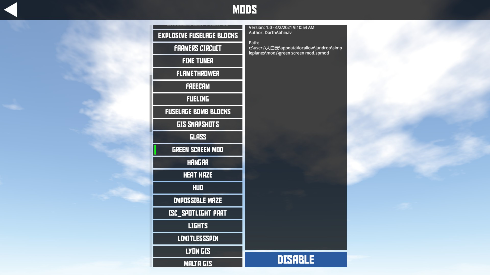

### Disassemble the windshield glass away

The colored windshield glass will disturb the following green screen handling, so, all the glass parts should be deleted.


You must check all the connection relations among the parts, and disconnect them before deleting them, or you'll delete useful parts.


Deleting one by one carefully, the final work here:


Then, let's fly in Green Screen!

### Green Screen snapshot

Select the second menu, **Mod Sandbox Maps**,


Then, choose the Green Screen from any other sandbox maps lists

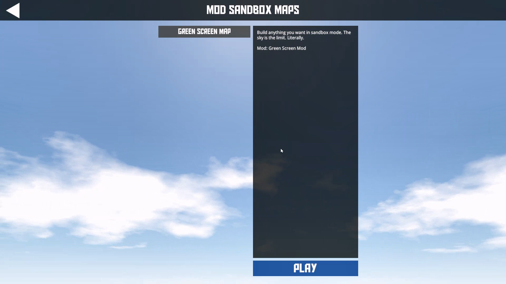

Fly! You'll find you are in red green, or blue, Select one place and take a snapshot. 

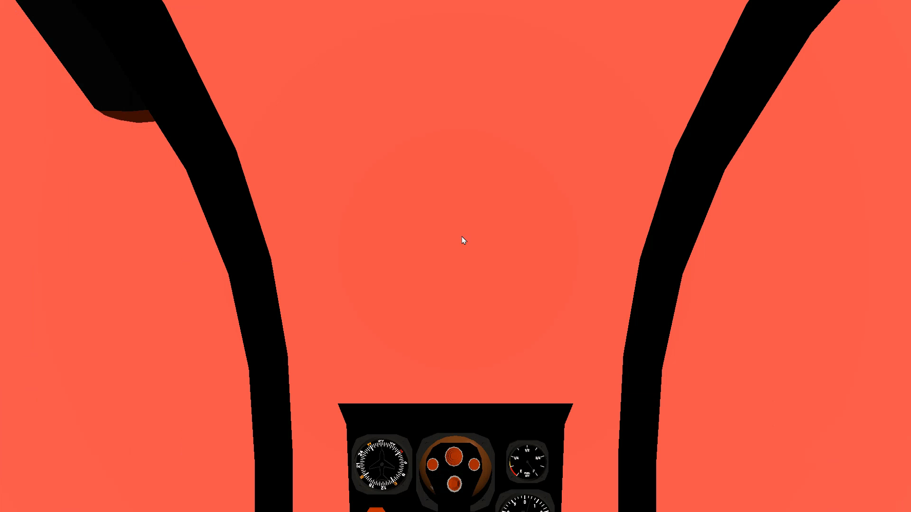

Press F9 to hide the SimplePlanes GUI, and press F12 to snapshot.

// video here:

<iframe width="1280" height="720" src="https://www.youtube.com/embed/ZvinsThADYQ" title="How to take a snapshot of SimplePlane cockpit transparently" frameborder="0" allow="accelerometer; autoplay; clipboard-write; encrypted-media; gyroscope; picture-in-picture; web-share" allowfullscreen></iframe>

## Make the picture transparent in ONLYOFFICE

The original snapshot picture is already, the background is colored green or red. To make the OTW part transparent, I use ONLYOFFICE instead of PhotoShop as a photo editor.


In ONLYOFFICE, there is a plugin module named **Photo Editor**, which is installed by default. Select the picture and open the Photo Editor to edit it.

Enable brightness first,


Drag the slider right, to make the red OTW colored lighter and lighter to almost white, then, 

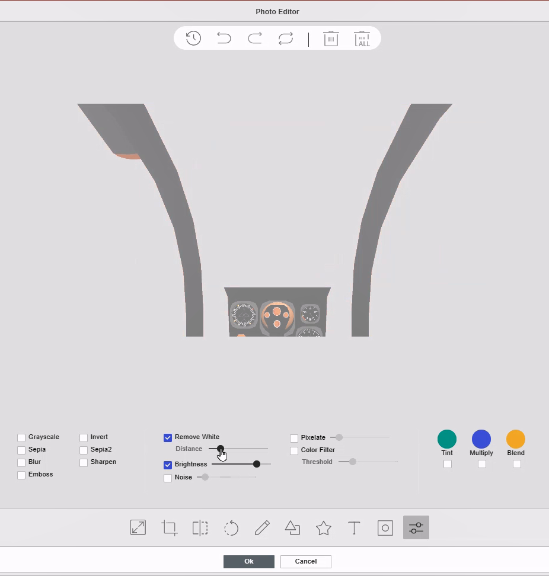

Enable **remove white**, drag the slider left or right, to remove the white color, and make it transparent. Press ok to save the work, and you will see the transparent cockpit now, but the instrument dashboard is colored too light now.

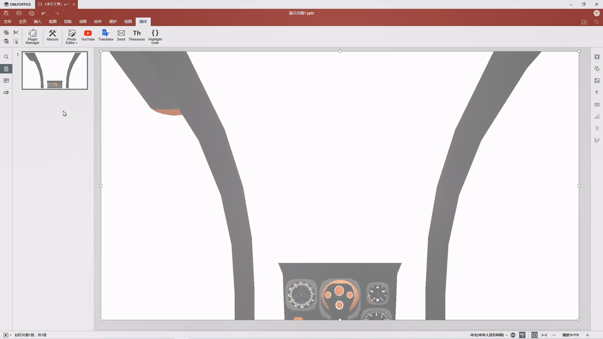

Let's make it colored back,


New a slide page, set the background colored any color, in the right properties bar. Copy the light-colored transparent picture from the first page to this second page:


Open the Photo Editor plugin again and drag the brightness slider back to the left, so that the color of the flight instrument dashboard recovers to normal color,


It is completed, save as a .png file:

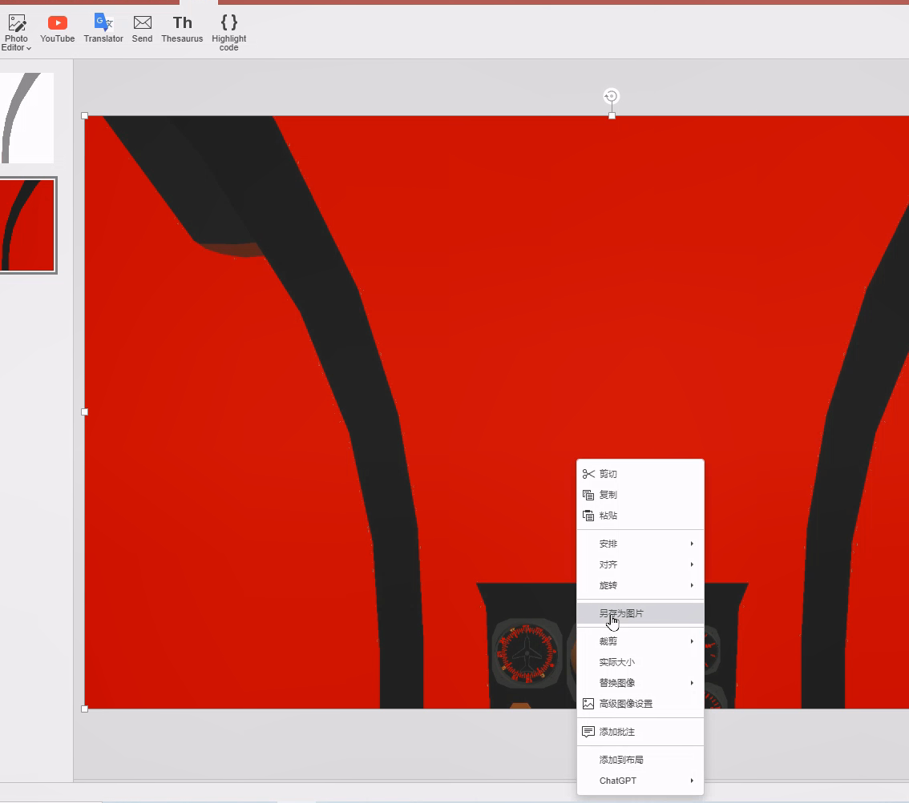

Make sure the filename is .png

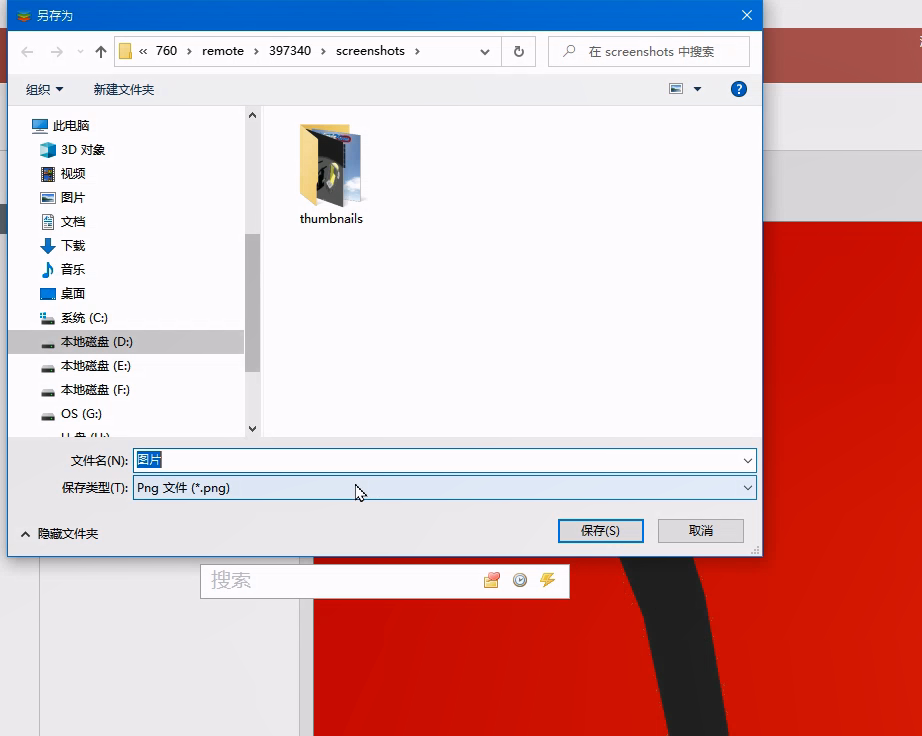

Open it in any photo viewer, the OTW part is transparent now

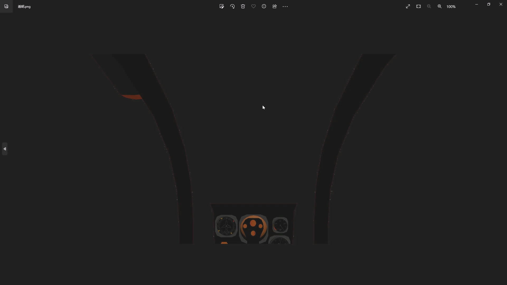

The picture here


## KML ScreenOverlay Maker

You should write a .kml file to reference the .png file path to load in GE, to make it easy, I have found a little software named **KML ScreenOverlay Maker**

[The KML Screen Overlay Maker Utility](https://freegeographytools.com/2007/the-kml-screen-overlay-maker-utility)

[KML Screen Overlay Maker Utility, Concluded](https://freegeographytools.com/2007/kml-screen-overlay-maker-utility-concluded)

Again, to avoid the disappearance of the too-old things on the internet, I have stored it in my space here:

[ScreenOverlayMakerInstall.zip](ScreenOverlayMakerInstall.zip)

It is very simple. 

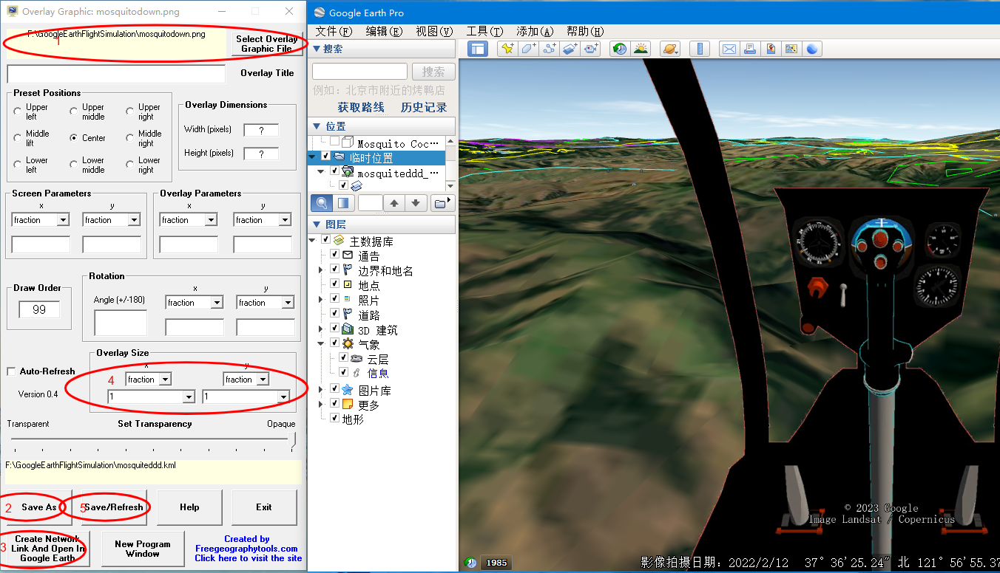

First, select the overlay graphic file, It's the .png file you have made just now.

Second, Save it as a .kml file, You do not need to save it to the directory of Google Earth installation directory.

Then, create a network link and open in Google Earth, This will pop up a window, let you specify where your **googleearth.exe** is located, Find it,  and press ok, This little tool will start Google Earth automatically, and your 2D cockpit will appear in it.

In the next step, in the overlay size part, select the **fraction** for both x and y and set a value for them, to me, value 1 is the best, according to my cockpit resolution size.

Finally, don't forget to drag the kml from temporary places to my places to save for future use.


Also, you can open the final kml file to see what is in it, It is very simple

```kml
<?xml version="1.0" encoding="UTF-8"?>

<kml xmlns="http://earth.google.com/kml/2.2">

<ScreenOverlay>

<color>ffffffff</color>
<drawOrder>99</drawOrder>
<Icon>

<href>F:\GoogleEarthFlightSimulation\mosquitodown.png</href>

</Icon>

<size x="1" y="1" xunits="fraction" yunits="fraction" />

</ScreenOverlay>

</kml>
```

# HUD

I wanted to use the original HUD at first, but, after I imported a fight Jet from SP, I got this cockpit


The 2D cockpit flight instrument dashboard overlays on top of the HUD, and a lot of important information is hidden by the image, so, I have to modify the HUD for the fight jet specifically.

The cockpit image here:


[And the HUD file here](generic%20J20.ini)

Make a backup and then modify the file **[generic.ini](generic%20J20.ini)** in the directory **hud**. For my fighter jet, relocate and shrink the elements in HUD. Fortunately, this file is very simple, not longer than 160 lines, Here are my configurations.

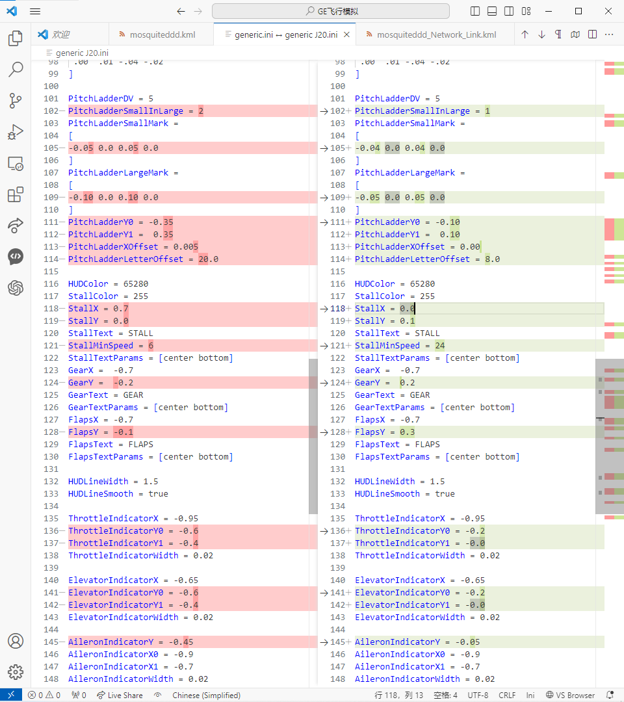

# The final work


2D fighter jet cockpit, hypersonic speed FDM, functional HUD instrument, reach anywhere on the earth in one hour!

This video demostrated my flight from Buenos to Beijing in one hour(Video accelerated).

<iframe width="1280" height="720" src="https://www.youtube.com/embed/mDaCqpkQb_U" title="Fly from Buenos to Beijing in just one hour" frameborder="0" allow="accelerometer; autoplay; clipboard-write; encrypted-media; gyroscope; picture-in-picture; web-share" allowfullscreen></iframe>