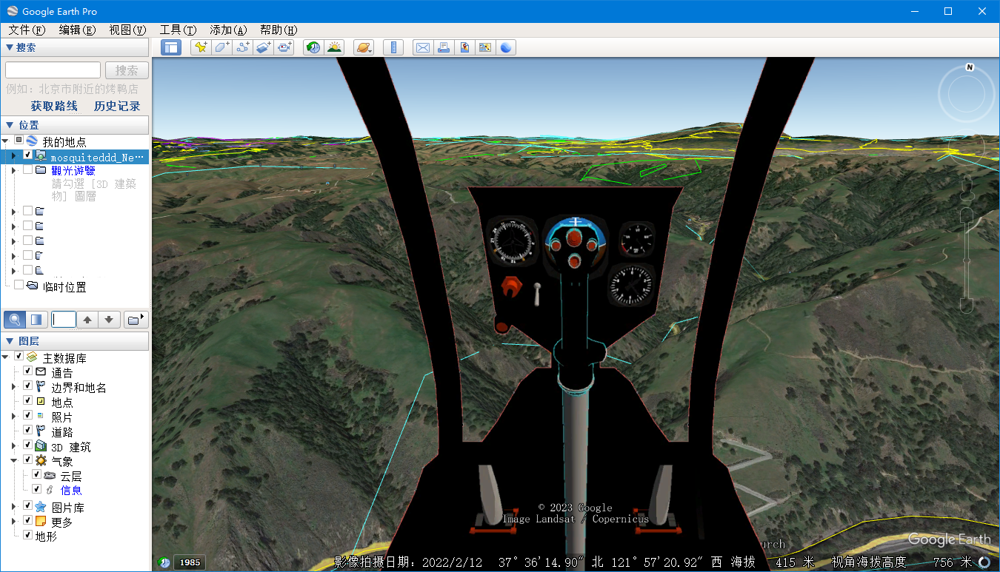

# 如何在谷某地球飞行模拟中导入简单飞机开发的飞机模型

简飞的飞友们！我并没有弃坑，只不过我不是你们想象的那样设计飞机。我之前写过一篇图文讲解如何在谷某地球里规划飞行航线：

[Flying a SR-22 through the great Valley Grand Canyon](https://aesuib.github.io/GoogleEarth/SR22flyingVally.html)


 而现在，我要导入由SimplePlanes开发建模的飞机仿真模型导入进谷某中飞行。

  众所周知，谷某飞行模拟里面只有两款飞机可以选择：


谷某地球并不是个开源软件，我本来以为无法扩展开发新机型，直到，有一天我在电脑中搜索**f16**无意中在谷某地球的安装路径中找到**f16.acf**这么一个文件，我发现它是一个纯文本文件：


那就意味着我可以拿它来搞点事情了。

# 添加新模型？不，只是修改已有模型

使用`tree`命令来查看谷某飞行模拟的文件夹结构：

```bash
PS C:\Program Files\Google\Google Earth Pro\client\res\flightsim> tree /f
卷 系统 的文件夹 PATH 列表       
卷序列号为 64DA-4693
C:.
│  flightsim.ini
│  
├─aircraft
│      f16.acf
│      sr22.acf
│      
├─controller
│      generic.ini
│      genius_maxfighter_f16u.ini
│      logitech_attack3.ini      
│      logitech_extreme_3d.ini   
│      logitech_force_3d.ini
│      logitech_freedom.ini
│      saitek_cyborg_evo.ini
│      saitek_x52.ini
│      speed_link_black_hawk.ini        
│      speed_link_black_widow.ini       
│      speed_link_cougar_flightstick.ini
│      speed_link_dark_tornado.ini      
│      xbox_360.ini
│
├─hud
│      generic.ini
│      sr22.ini
│
├─keyboard
│      generic.ini
│      sr22.ini
│
└─planet
        earth.ini
```

非常简单，**flightsim.ini**好像是根配置文件。


我就在这个文件里面添加了自己飞机的一个条目，测试一下，但是，谷某地界面GUI中并未显示我新加的选项，我也没有找到谷某地球软件的界面可以在哪里进行扩展开发。


谷某地球的GUI界面并不是开源的，只能在自带的两款机型中选择，所以，下面的所有工作，都是在原有的模型基础之上修改，当然，在修改之前要先做好备份。

# 文件结构


文件夹**aircraft**包含了飞行气动模型配置文件 **.acf**，每个文件对应一款型号，它是飞行模拟的核心配置文件。

文件夹**controller**包含 **.ini**格式配置文件配置不同型号的外设飞行摇杆的使用。但是，GEFS本身就不是那种大型精细的飞行模拟软件我认为不需要连接外设，而更倾向于直接用键盘鼠标来驾驶飞行。

文件夹**hud**包含为不同型号飞机配置HUD平显的**.ini** 配置文件，其中F16使用的是**generic.ini**文件。

文件夹**keyboard**包含了用键鼠飞行的**.ini** 配置文件，默认配置就很好无需修改。

文件夹**planet**包含了 **.ini**格式文件配置不同行星的参数，默认只有一个配置即我们地球自己，但是你可以为火星单独新建一个配置文件。

没有驾驶舱？实际上你可以给GEFS添加一个虚拟驾驶舱画面的。

# 飞行动力学模型FDM

原始的两个飞行动力学模型对于大多数飞行已经够用，但是，仍然有两个痛点。

## 高超音速飞机


一个痛点就是长距离跨大洋洲际飞行，我曾画过一条从亚洲飞美洲的航线，计划很完美，但飞行很无聊。GEFS并没有可以让人离开电脑休息的自动飞行模式，也没有时间加速功能，我只能必须一直握着鼠标控制稳定飞机好几个小时。

我需要一款高超音速飞行的飞机，能够让我在半个小时之内飞到地球上任意地点。

我们飞友有一句名言“力大砖飞”，就是说，只要动力足，板砖飞上天，所以，修改**f16.acf**文件：


增加动力减少质量，这样就能让F16飞出高超音速！

[点击下载高超音速飞机的.acf配置文件](f16-HyperSonic.acf)

将下载的该文件重命名为f16.acf并替换谷某自身的f16.acf文件，爽去吧！

<iframe width="1280" height="708" src="https://www.youtube.com/embed/e5yWmni-MQU" title="Google Earth Pro FlightSimulation Hypersonic Aircraft Model" frameborder="0" allow="accelerometer; autoplay; clipboard-write; encrypted-media; gyroscope; picture-in-picture; web-share" allowfullscreen></iframe>

注意！这模型飞的太快了！驾驶她必须要轻轻操作，否则整个谷某地球软件就会崩溃，从跑道上起飞只需要把油门推动一点即可，而降落则需要把油门彻底降低到零。

## 低速高机动直升机

另一个痛点就是在飞机上仔细观察地面地形，这就要求飞机既要飞的慢，又要转弯迅速，最好还能随处降落起飞，比如我之前飞过的这样：

[Flying a SR-22 through the great Valley Grand Canyon](https://aesuib.github.io/GoogleEarth/SR22flyingVally.html)


所以，选择一款直升飞机最合适，但是原装自带的都是固定翼飞机模型，修改为旋翼飞机的启动模型，就需要对 **.acf**文件里面进行重大的改动。

我谷某搜索了很久，终于找到了：

[New Flyable Planes for Google Earth](https://googleearthcommunity.proboards.com/thread/4186/new-flyable-planes-google-earth)

还有这个链接：

[Planes For Google Earth Flight Simulator](https://www.gearthblog.com/blog/archives/2009/08/planes_for_google_earth_flight_simu.html)

但是第二个网页里面的模型下载链接都已经失效了，这网页太老了，锁眼公司的官网都已经关张了。所以，我下载了第一个页面里面的所有模型，并且抢救性挖掘保存在了我的空间里面了：

| 文件 | 模型 |
| --- | ----|
| [f16 f35.acf](f16%20f35.acf) | F-35 |
| [f16 typhoon.acf](f16%20typhoon.acf) | Typhoon | 
| [f16 p51.acf](f16%20p51.acf) | P-51 |
| [f16 m2000.acf](f16%20m2000.acf) | Mirage-2000 |
| [f16 gripen.acf](f16%20gripen.acf) | Gripen |
| [f16 f15.acf](f16%20f15.acf) | F-15 |
| [f16 su27.acf](f16%20su27.acf) | Su-27 |
| [f16 crj900.acf](f16%20crj900.acf) | CRJ-900 |
| [f16 apache.acf](f16%20apache.acf) | Apache |

这些模型里面有一架旋翼机，阿帕奇Apache，使用阿帕奇的飞行动力学文件替换原装的西锐SR22的，就可以飞直升机了！

<iframe width="1280" height="720" src="https://www.youtube.com/embed/hyznS3mmgqQ" title="" frameborder="0" allow="accelerometer; autoplay; clipboard-write; encrypted-media; gyroscope; picture-in-picture; web-share" allowfullscreen></iframe>

注意！直升机很难飞，尤其是对于飞惯了固定翼飞机的飞行员来说。

> 记住，这架阿帕奇的起落架是固定式的，飞行时要保持伸出的状态。由于直升机没有襟翼flaps，飞行时也不要操作襟翼。猛拐弯的操作，要侧倾滚的同时按住小键盘区域的0或enter按键，没有小键盘区域的话就按住shift+左右键，这样来蹬舵转身。恢复杆和舵请按C按键或小键盘的5按键。直升机降落，要慢慢的接近降落场，轻轻的下降保持稳定的下降率。
> 
> 警告：不要加速超过200Knots，不仅仅是这个飞机模型不要超过速度限制，而且也是因为如果你飞地太快它将让谷某地球不堪重负崩溃而死。

Apache的FDM从原装的F16改变了很多：


你可以随意更改它。

# 2D驾驶舱

除了HUD平显，你还可以给GEFS添加一个2D驾驶舱。谷球本身是支持导入3D模型的，但是3D模型必须只能添加到地表上一个位置，或者在地球上绘制一个轨迹让3D模型运动起来，3D模型并不能贴在视角镜头上面，所以只能给飞行模拟添加一个2D驾驶舱贴图。

2D驾驶舱并不是一个模拟驾驶舱，仪表板上面的飞行仪表并不能真实运作，只是一张贴图，静态的，叠加显示在窗口里渲染画面之上。但这也比原本没有驾驶舱的谷某飞行模拟好多了。一般的飞机驾驶舱飞行员仪表，飞行仪表板位于视野下侧，左右两侧有飞行驾驶舱风挡玻璃的窗框。

最重要的是，风挡玻璃是透明的，这样你就可以从2D驾驶舱贴图上的风挡玻璃看穿出去，正常的看到舱外视野，缩写为OTW（Out-The-Window），你必须能从驾驶舱内飞行员头部位置看到舱外看到蓝天大地。所以，最终所需要的图片应该是.png格式，在OTW部分是透明的。

开动！

## 根据飞行任务选择一款飞机型号

所以首先需要制作一张驾驶舱图片。以上面所讲的[低慢飞行](#low-speed-super-maneuver-helicopter)为例

为了能在天上飞行中更好的鸟瞰大地，这架飞机应该有很大很大的舷窗风挡，而大多数固定翼飞机的风挡视角在下视方向的可视角度非常受限，所以建议最好选择一款直升机，并且飞机越小舷窗越大越好，最终，我找到了[蚊式直升机](https://composite-fx.com/models/xe/)


## 在SimplePlanes官方网站上找到该款飞机的仿真建模

选择[SimplePlanes](www.simpleplanes.com)飞行模拟软件来找到该型号飞机模型，这是沙盒建模类游戏，全世界有很多的玩家设计师，几乎为全世界所有的飞机型号建造了模型并且上传到该网站，你可以查找到任何一款模型。我最终找到了[mosquito](Mosquito)在这里由设计师[Alucard689](https://www.simpleplanes.com/u/Alucard689)建造的。

## 绿幕mod扩展插件

还需要安装[Green Screen Mod](htt://www.simpleplanes.com/Mods/View/1360127/Green-Screen-Mod)，用以在驾驶舱内拍照截图驾驶舱画面。


### 拆除风挡框架上的风挡玻璃

模型上的有色风挡玻璃会干扰在绿幕前的截图效果，所以，要手动拆除删掉这些玻璃零件。


必须仔细检查每一个要拆除零件的与其它零件的连接关系，断开连接后再删除，否则就会把连带的要保留的零件给一起拆除掉了。


一块一块地拆除窗玻璃，最终完成品在这里：


进入绿幕飞行吧！

### Green Screen snapshot

在软件首页选择菜单第二项：**Mod Sandbox Maps**：


然后选择绿幕地景，如果有很多地景选择项的话。


起飞！你就会发现你深陷一片红或者一片绿之中，随意选择一个位置，截图一张


按快捷键F9隐藏SP软件本身的叠加在画面最顶层的界面GUI，再按F12快捷键截图。

<iframe width="1280" height="720" src="https://www.youtube.com/embed/ZvinsThADYQ" title="How to take a snapshot of SimplePlane cockpit transparently" frameborder="0" allow="accelerometer; autoplay; clipboard-write; encrypted-media; gyroscope; picture-in-picture; web-share" allowfullscreen></iframe>

## 使用ONLYOFFICE将截图修改为透明效果

原始截图准备好了，背景是绿色或者红色这样的单一颜色。为了将OTW部分设为透明，我选择了使用ONLYOFFICE，而不是PhotoShop，来进行图片编辑。


在ONLYOFFICE里面有一个扩展插件叫做**Photo Editor**图片编辑功能，这是默认即安装的，选择这个图片再点击工具栏上的这个按钮就可以打开图片编辑器了。

首先调整亮度brightness：


将滑块向右拖动，是的红色的OTW部分的颜色越来越浅，最后变为基本全白的样子，然后：


选中开启**remove white**复选框清除白色功能，左右拖动滑块，移除图片里面色彩为白色的地方的颜色信息，使得白色的地方变为透明，点击OK确认保存编辑工作，就能看见驾驶舱图片的透明玻璃效果了，但是目前的飞行仪表板部分仍然是颜色过浅的状态。


再把颜色调深回正常状态：


新建一页ppt，从右侧边栏的页面属性框中，将该页ppt的背景颜色随意设置一个非白颜色。将刚才页面中编辑好的浅色透明座舱仪表图片拷贝到这个新建的第二页ppt里面：


在图像编辑器插件中再次调节亮度滑块，向左拖动，将飞行仪表板颜色调节至正常的样子：


这样就完成了，将该图片导出另存为.png图像文件：


确保文件名后缀是.png


使用任意一款图片查看器打开，这张图片确实是背景透明的：


完工的蚊式驾驶舱仪表2D贴图如下


## KML屏幕贴图生成器

你应该编写一个.kml文件来指定这个.png图片文件的路径，在谷地里面加载这个kml文件。为简化开发，我在网络上找到一个小工具软件，**KML ScreenOverlay Maker**

[The KML Screen Overlay Maker Utility](https://freegeographytools.com/2007/the-kml-screen-overlay-maker-utility)

[KML Screen Overlay Maker Utility, Concluded](https://freegeographytools.com/2007/kml-screen-overlay-maker-utility-concluded)

再次，为了避免互不联网上面的特别老旧的东西消失灭绝，我保护性挖掘出来存储在这里了：

[ScreenOverlayMakerInstall.zip](ScreenOverlayMakerInstall.zip)

它非常简单：


首先，选择要加载的图片，就是刚刚制作的.png文件。

然后，保存出.kml文件，并不需要把它保存到谷球的安装路径中去。

然后，创建一个network link，启动谷球，这会弹出一个窗口，手动指定一下你自己的**googleearth.exe**的路径，确认后，这个工具就会自动打开谷球，你的2D驾驶舱就会出现在画面里。

下一步，在**overlay size**部分，x和y都选择**fraction**，设置一个数值，对于我自己的显示器分辨率来说选择1是最好的。

最终，别忘了拖动这个kml从谷球临时位置到我的位置，保存下来以后使用。



你也可以打开这个最终kml文件来查看里面到底是什么内容，其实很简单：

```kml
<?xml version="1.0" encoding="UTF-8"?>

<kml xmlns="http://earth.google.com/kml/2.2">

<ScreenOverlay>

<color>ffffffff</color>
<drawOrder>99</drawOrder>
<Icon>

<href>F:\GoogleEarthFlightSimulation\mosquitodown.png</href>

</Icon>

<size x="1" y="1" xunits="fraction" yunits="fraction" />

</ScreenOverlay>

</kml>
```

# HUD平显

我原本想使用原装HUD平显不再改动，但是，当我导入一个喷气式战斗机的驾驶舱之后，我发现效果是这样的：


2D驾驶舱仪表板叠加显示在最上层，将HUD平显部分覆盖到下层去了，这样，很多重要的HUD平显信息就看不见了，所以我不得不专门为该款喷气式战斗机而修改HUD平显了。

驾驶舱图片在这里：


[开发完的平显HUD文件在这里](generic%20J20.ini)

首先备份好原始文件，然后再修改**hud**文件夹下的 **[generic.ini](generic%20J20.ini)** 这个文件。对于我的战斗机来说，需要移动HUD平显中各个要素的位置并缩小各个要素的尺寸。幸好该文件非常简单，只有不到160行代码，我做了如下这些修改：


# 最终成品


2D战斗机驾驶舱，高超音速飞行动力学FDM，有功能的HUD平显仪表画面，可以在一个小时之内飞抵地球任意位置！

该视频展示了我驾驶歼20战斗机从亚洲东部的中国北京直飞南美洲阿根廷的布宜诺斯艾利斯，仅仅花费了一个小时的飞行时间，另外这个视频在飞行中段开启了加速效果因而视频缩短到只有不到半个小时。

<iframe width="1280" height="720" src="https://www.youtube.com/embed/mDaCqpkQb_U" title="Fly from Buenos to Beijing in just one hour" frameborder="0" allow="accelerometer; autoplay; clipboard-write; encrypted-media; gyroscope; picture-in-picture; web-share" allowfullscreen></iframe>

