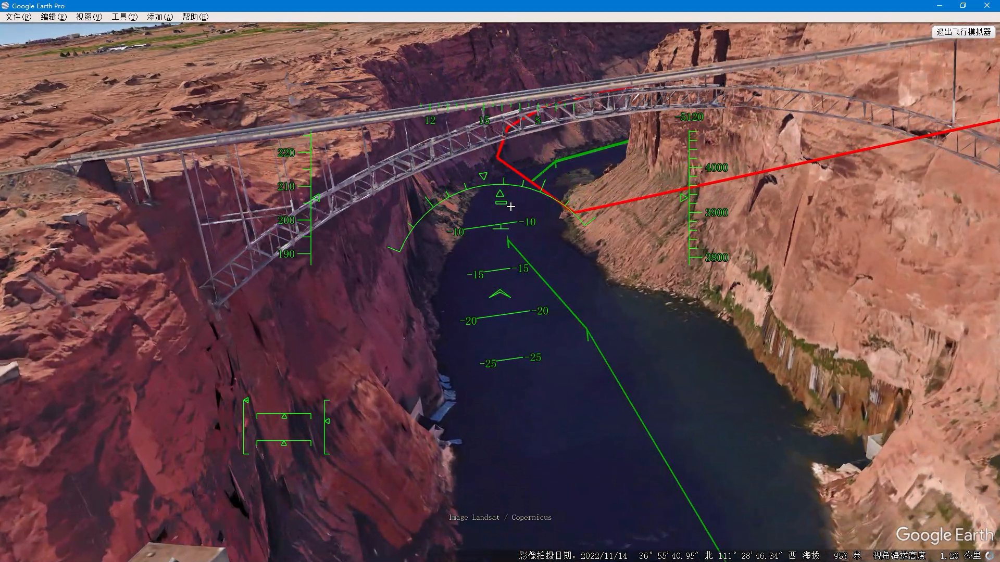

# Flying a SR-22 through the great Valley Grand Canyon

I'm bored of airfield patterns in flight simulation games and want a cross-country flight. While in SimplePlanes, I won all the race tracks. So, I drew a race scenario on Google Earth and had a try. Video here:

[Youtube video here](https://www.youtube.com/watch?v=wMe9lEG4Av0)

// embedded youtube video code here:

```html
<iframe width="560" height="315" src="https://www.youtube.com/embed/wMe9lEG4Av0" title="YouTube video player" frameborder="0" allow="accelerometer; autoplay; clipboard-write; encrypted-media; gyroscope; picture-in-picture; web-share" allowfullscreen></iframe>
```

[the scenario file is available here](Vally.kml)

kml file is recommended, it's texted based and can be opened in vs code, one more step, it could be handled with the plugin `Geo Data Viewer`


In fact, It's not necessary to design this scenario. But without this, it's easy to lost in such many Valleys in Colorado, so, I draw the route for myself to fly from Powell to Mead.

It is straightforward to make such a scenario for an air race on Google Earth. Add a route from the 3rd button in the toolbar:


Then, a window pops up, drag it to one side, view the map, move your mouse to a position, and left-click to add one point to the route, move the mouse and click to add more points, in the final, input the name for the route in the window, click ok to save, it's done!


Pay attention, in this view, you cannot drag the earth with your mouse because mouse clicking is used to add points, instead, you should use the keyboard shortcut to pan the map all around, `a` for left, `d` for right, `w` for up, and `d` for down. To zoom in and out of the earth view, you should use the mouse wheel, roll up and down.

Through these operations, I made this scenario of an air race in the Valley, It is so long, that I spent one hour and a half, with the SR-22 aircraft, to complete the route, it's from Lake Powell to Lake Mead, about 544 km. You are right, I did have a try with the F-16 aircraft, but its jet engine is so powerful that it flies too fast, so, I collided with the Valleys all the way, and in the final, I give up this jet plane. But, I recommend you to have a try, with the F-16, It's quite challenging!


To make the operations in flight show clearly in the recorded video, I started a keystroke visualizer software, you can see it in the right bottom corner. In fact, the flight operations on Google Earth are very simple. The mouse emulates the joystick, just left-click the mouse to switch it on. `page up/page down` controls the throttle, `g` lower the gear down and up, `f/shift+f` control the flaps, you should extend flaps quickly when you see your speed drops too quickly, and extract flaps up as soon as you gain your speed back, to avoid a stall in the violent maneuvering, pay attention to your speed all the way! 
`ctrl+up/down/left/right` control the pilot's view away from the nose vector of the aircraft. It's very useful when maneuvering violently if there is dog fight mode in the simulation. While in Google Earth, maneuver in the valley, you should raise your head up to see the upcoming corner of the valley side. But the HUD display is available only when the pilot views ahead of the aircraft nose, it is not a HMD.

The most important point of this video is to show off a great demonstration of the terrain of our earth with Google Earth. The data paging procedure, downloading data from the online GoogleEarth server, the view of the mountain changes from a great mosaic to texture in detail, the outline of valleys changes from a huge box to a smooth curving surface, and so on.

One interesting thing is, passing through two bridges in the video, one is Glen Canyon Bridge.



The other is Navajo Bridge.


In the final, you can download the scenario made by me and enjoy yourselves!


