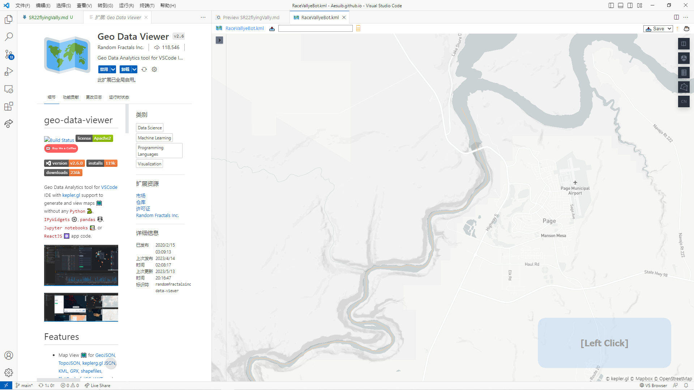
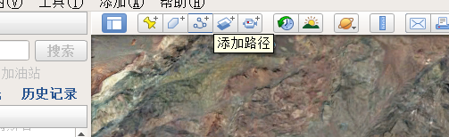
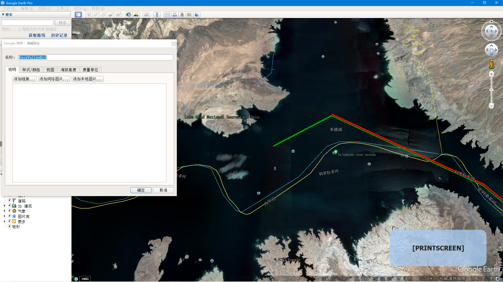
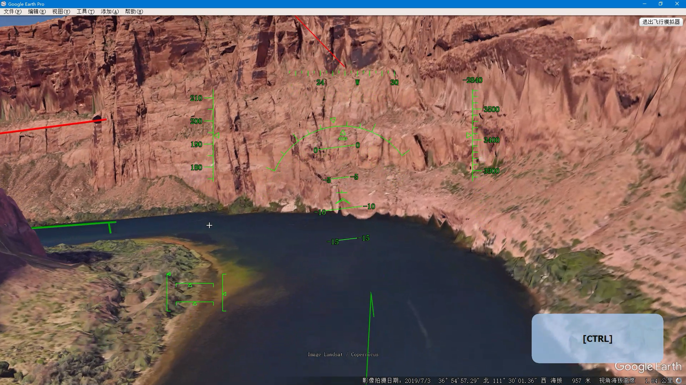
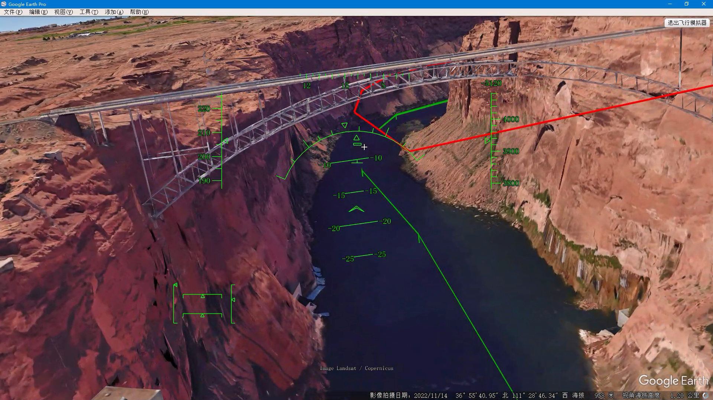
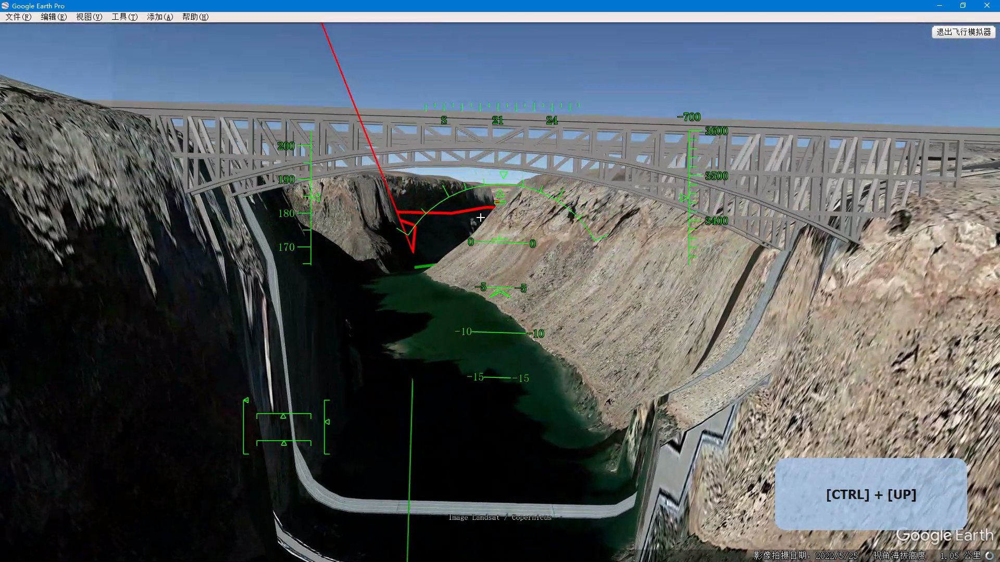

# 驾驶西锐SR-22小飞机在美国大峡谷中穿行

我已经厌烦了无聊的围绕机场的五边飞行了，想飞一趟跨越乡野的转场飞行了。在我常用的飞软SimplePlanes里面，我已经完成取胜了所有的竞速赛道，我想自己创建一个航路想定，最终选择了Google Earth做了成功的尝试：

[Youtube video here](https://www.youtube.com/watch?v=wMe9lEG4Av0)

// embedded youtube video code here:

```html
<iframe width="560" height="315" src="https://www.youtube.com/embed/wMe9lEG4Av0" title="YouTube video player" frameborder="0" allow="accelerometer; autoplay; clipboard-write; encrypted-media; gyroscope; picture-in-picture; web-share" allowfullscreen></iframe>
```

如果想要获取想定文件Valley.kml，请联系本作者。

[the scenario file is available here](Vally.kml)

推荐使用kml格式文件，这是纯文本格式文件，可以在VScode代码编辑器里面打开，并且，可以在VScode中安装插件`Geo Data Viewer`来处理该类型文件：




实际上，并不是必需要在谷球里面规画这一条航线，但是不这样做的话，实际飞行中就会迷失在群山峻岭的沟沟壑壑之中了，所以我为自己规画了一条从鲍威尔湖（Lake Powell）到米德湖（Lake Mead）的航线。

在Goo球里面画一条航迹非常简单，从顶部的菜单栏左数第三个按钮添加一条航路：




然后弹出窗口，拖动到一旁，显露出地图，移动鼠标光标到地图上一点，左键单击一下添加一个航路点，再移动鼠标光标再单击就再添加一个航路点，以此反复添加航路上的各个拐点，航路终点处点击后，在弹出的窗口中输入航路名称，点击保存，即可完成！




注意，这个地方你不能用鼠标来拖动地球画面，因为鼠标的移动与电机的操作已经变成为添加航路点的操作了，因此，替代鼠标操作，你应该用键盘快捷键来操作地图，a键左移d键右移，w键上移，d键下移，地图的放大缩小则是用鼠标滚轮的上下滚动来操作。

这样，我就做好了穿行大峡谷的飞行赛道，它是这么的长，以至于我花费了一个半小时的时间，才能驾驶西锐SR-22小飞机完成整条航线，从鲍威尔湖到米德湖，总长大约544公立。你猜的没错，我确实先尝试了驾驶F-16喷气式战斗机，但是它的发动机太强劲了，飞行速度太快了，以至于在峡谷急拐弯处会撞上崖壁，最终我就放弃了石榴姐。但是，我强烈建议你也尝试一下F-16，这非常具有挑战性！




为了让模拟飞行的操作能够在录屏中展示出来，特意运行了一款按键可视化工具软件，你可以在画面右下角看到它的效果。实际上，谷Earth的飞行模拟模式非常简单，使用鼠标来模拟飞行摇杆的前后左右，只需要鼠标左键单击一下来开启鼠标控制，`page up/page down`控制油门，`g`放下和收起起落架，`f/shift+f`收放襟翼，当你看到空速剧烈下降的时候就要及时放出襟翼，而看到空速涨回来就要及时收起襟翼，尽力避免在剧烈机动中失速，必须时时注意你的空速！

`ctrl+up/down/left/right`控制飞行员自己的脑袋离开正视前方而转向查看哪个方向。在剧烈机动中这非常有用，比如战斗机近距离缠斗。而在Goo球里面虽没有空战但是在峡谷中需要快速改变航向，你需要适当仰头望向山谷拐向的前方。但是谷Earth的HUD平显画面只在飞行员脑袋视野平视前方机鼻指向的时候才会显示出来，它并不是头盔显示器HMD。

另外，左右蹬舵的操作是小键盘区的`0`键和`enter`键，但是在谷球里面并没有侧风让你有机会蹬舵补偿的，最多只是降落接地后蹬舵修正保持在跑道上或拐弯到停机坪上。

这个视频主要是展示Goo球的大地形渲染效果。随着飞行，地形瓦片数据逐渐加载进内存，从那个不存在的公司的在互联网上的服务器实时下载地球数据，画面视野中远处的大山逐渐从最粗的马赛克变化为精细纹理的表面，山体的轮廓从立方体逐渐变形为平滑曲面，城镇、桥梁等会加载显示三维模型，等等。

激动人心的时刻是，在视频里面从下方穿越了两座大桥，跨越科罗拉多河谷的大桥，一座是Glen Canyon（格兰峡谷）大桥。




另一座是Navajo（纳瓦霍）大桥




# 最后，欢迎试飞这个赛道体验这激动人心的飞行！

