# 使用国内Linux发行版的必备功课之一

首先要说的是，自己使用Linux仍然是很菜的，但是又很爱玩，就是俗话常说的

# 人菜瘾大

但，即使自己这么菜，还是把这件必备功课给做了，这就是给群里各位大佬一个鼓励，毕竟在这个群里面，群除我佬，我都搞定了，大佬们就都应该也能搞定吧

我最近在自己Windows10系统的台式机上安装的虚拟机Virtual Box软件里安装的虚拟机系统，国产深度和国产欧拉，两个，在这两个里面安装生产力服务软件，ONLYOFFICE协作空间服务器，就遇上那个问题了。

并且这可以说是一个普遍性存在的问题了，nodejs的npm被抢的才多呢，搞一次痛不欲生，国内库，代理都用上，也还是要看运气，但凡用过docker也都会遇到，github也是被随机断线的站点，那天在kde社区看到一个issue，一个俄罗斯人报告说kde封锁了俄国的IP。社区管理员无奈的解释说不是他们干的，中美俄在互联网的世界上就是互相坑啊。

这实际上是两个紧密关联的问题，为了讲明白，这里拆分一下，关于协同办公，协作空间，ONLYOFFICE的内容，都放在我在国内的博客平台上面，而那个问题，必备功课，就放在这篇文章里面。

那个问题，出现在这里：

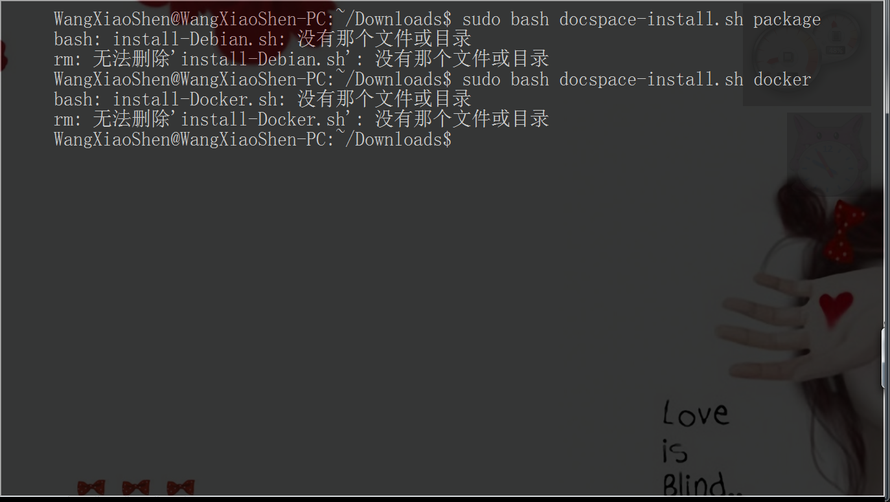

执行这个`docspace-install.sh`安装程序脚本，会立刻报错退出，报错信息是另外一个脚本文件找不到？每一个英文单词和中文汉字我都认识，连起来的这句话的意思也很直白，我在路径下面查看了，也确实如他所说没有那个文件，这好像确实是一句毫无有用信息的废话，安装过程就卡在这里了吗？真实原因是什么？我白丝不得其解……

# 咣当——————我撞！

我反复看这几句中文，她说没有的是那个文件而不是这个文件，那个而不是这个，那个这两个字，那个，那个……那个？？？这是撞上那个东西了吗？

于是我用vscode打开这个`docspace-install.sh`文件，果真找到了：

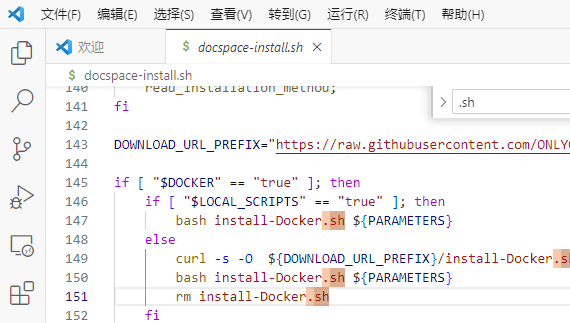

找不到的文件是这个脚本执行中要下载到本地的，如果下载不下来，那就退出安装，但是不管下载下来没有，退出程序之前要删除这个下载的文件，如果是没有下载到文件，那么在执行删除的时候，就会很自然的要报告错误信息了，脚本里面还能直接看到下载的网址，仔细看域名

[raw.githubusercontent.com](raw.githubusercontent.com)

果真，和那个我不得不经常捏着鼻子上的臭名昭著的世界上最大的同性交友网站有关系！

难怪会被炖！用ping来测一下，果真是炖熟了的：

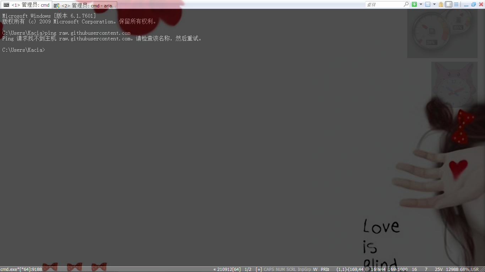

用网页浏览器查看是这样的

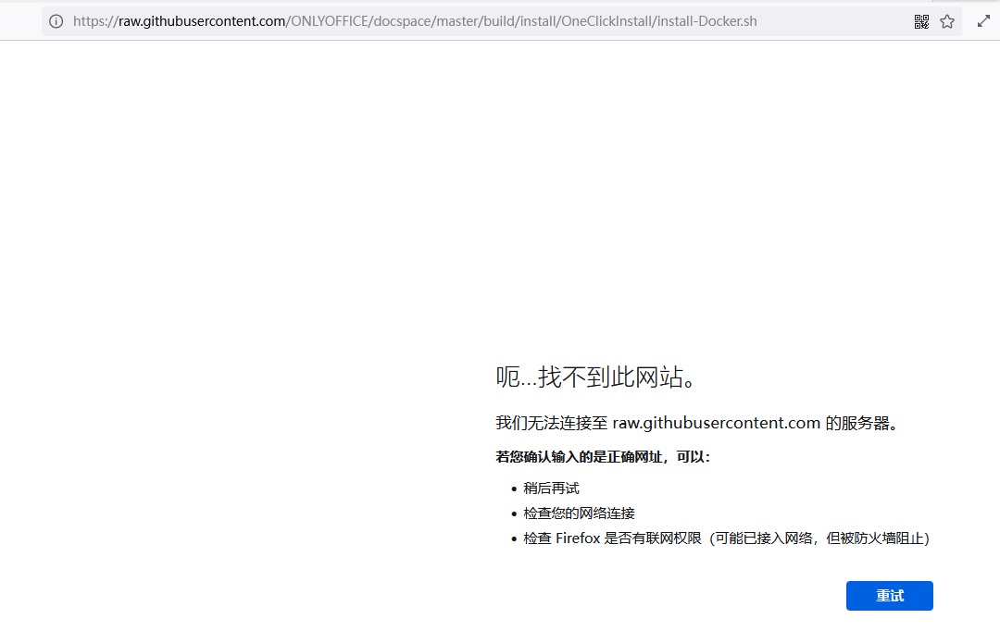

不死心，我把下载安装子脚本的语句从脚本程序中提取出来，单独用curl和wget命令手动下载，果然还是都下载不到：

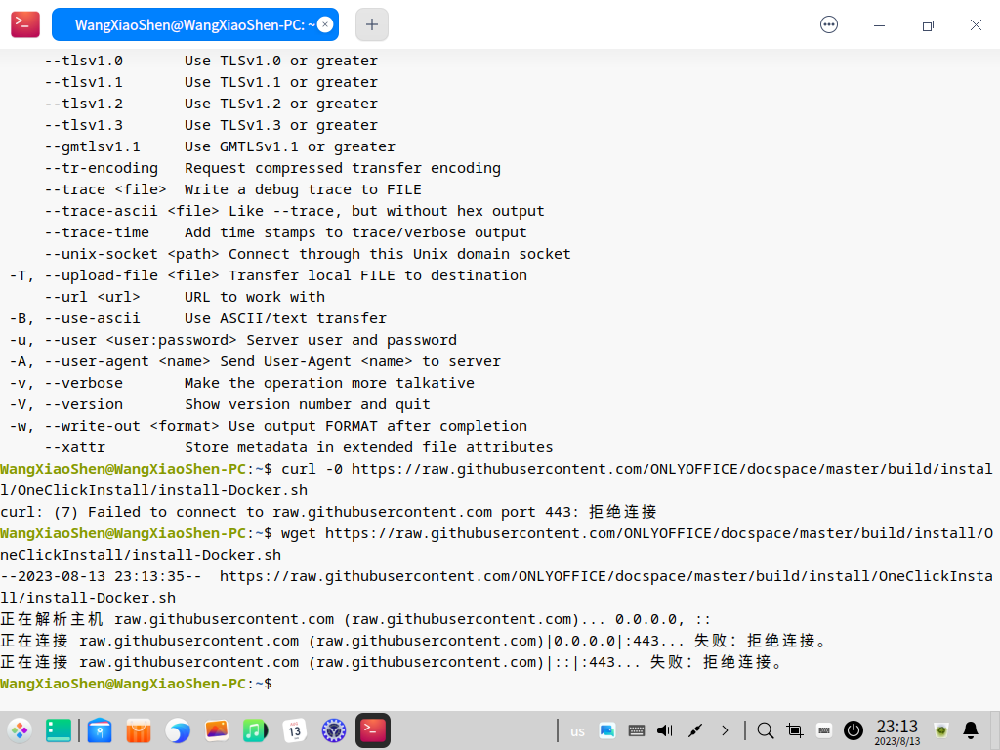

# 修改hosts

如果只是把眼前这一个网站给连上去，可以手动修改一下本机的hosts文件，直接指定域名的ip地址。先得要查出来一个网站域名实际上都有哪些ip地址，这件事在网上有很多网站可以查，比如我用这个：

[sites.ipaddress.com](sites.ipaddress.com)

把被煮网址贴进去查询得到一般信息：

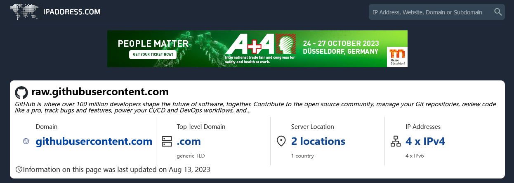

页面很长，下拉到最底下，就可以看见真实ip地址了：

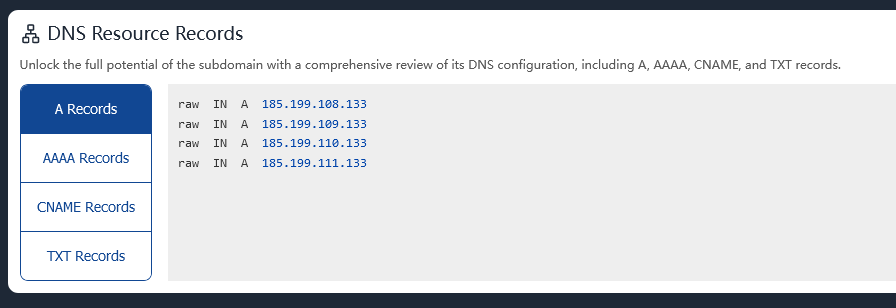

然后修改文件`\etc\hosts`，在末尾添加一行配置：

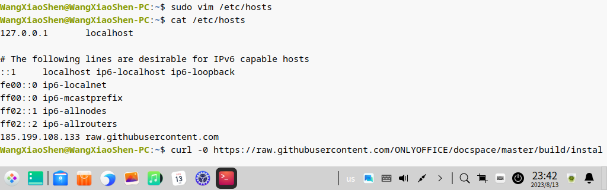

然后再curl就不会再报错了，就可以执行这一个软件的安装了，以后，每遇到一个不太和谐的网站，就添加一条配置，时间长了，你的hosts文件恐怕就会成千上万行了，所以，如果要长期使用Linux系统的话，还是需要一个比较通用的底层的手段来稳定的越洋。

# 小飞机越洋飞行

不知道从什么时候开始的，已经很久了，大多数这样的软件的图标，都是纸飞机，小飞机，所以我们就把这一类软件统称为小飞机了，即使我这里用的软件的图标是个V，但也还是管它叫做小飞机啊，说机不说吧，文明你我他。

小飞机软件有很多，大部分都是针对Windows客户端和安卓客户端的，Linux下面我找了很久，终于找到一个v2rayA，安装细节就略去，自己先在Windows系统下驾机出洋搜到它的官方网站，找到安装说明，安装到Linux系统下面，

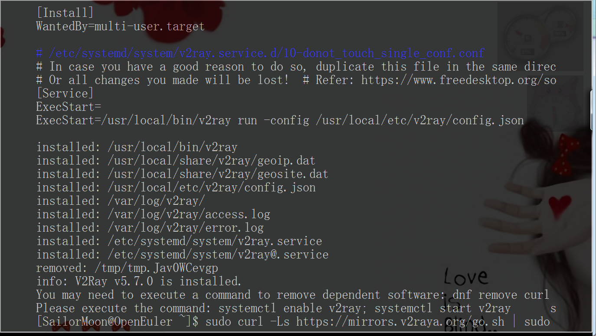

装好后就是下图开始菜单中的第三项

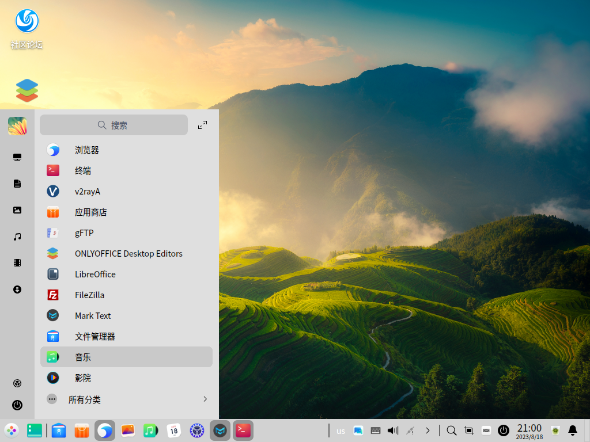

对于飞机主来说，并不是有了私人小飞机，就能天高任鸟飞了，飞机主装上后，还需要自己去花费功夫去找飞机场租买航额，找得着找不着就看你的造化了，佛曰只渡有缘人。

租到航额后，就可以按照卖家给出的航线细节，打开自己的linux电脑的小飞机的导航系统设置页面，添加进航额信息，类似下图：

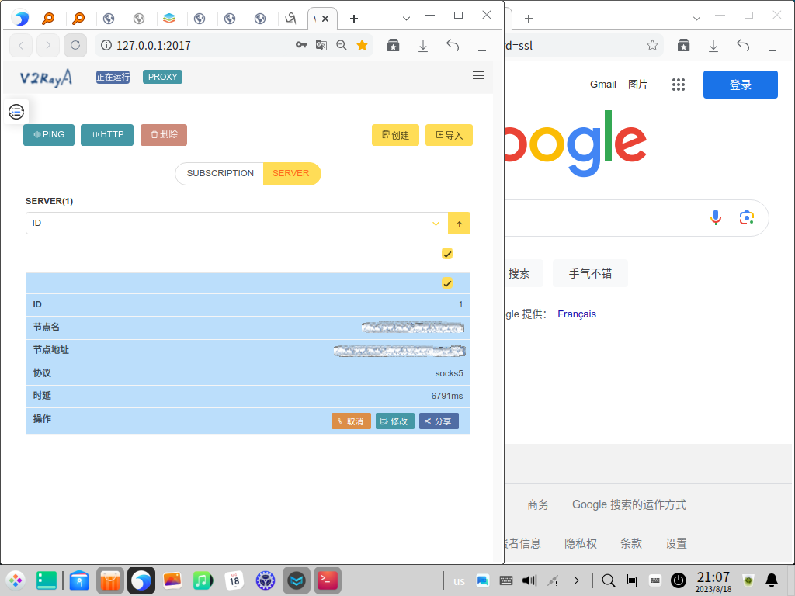

然后就可以愉快的玩转Linux了！Linux的好处就是可以当作服务器使用，比如可以用网内其他Windows系统电脑打开linux系统电脑的上图飞控页面来维护小飞机，让小飞机成为通信中继长航时无人机，可以给小飞机开通局域网共享，就可以让家里或办公室的局域网内所有其他的Windows电脑、安卓手机开心的环球飞行了。Linux电脑就可以玩转各种先进生产力软件而不会阻碍生产力发展，毕竟，我们要使用用先进的生产力来为人民服务。

