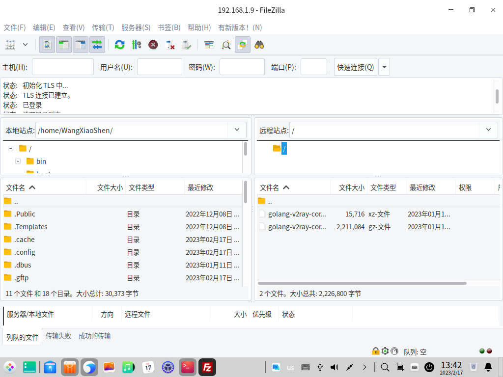
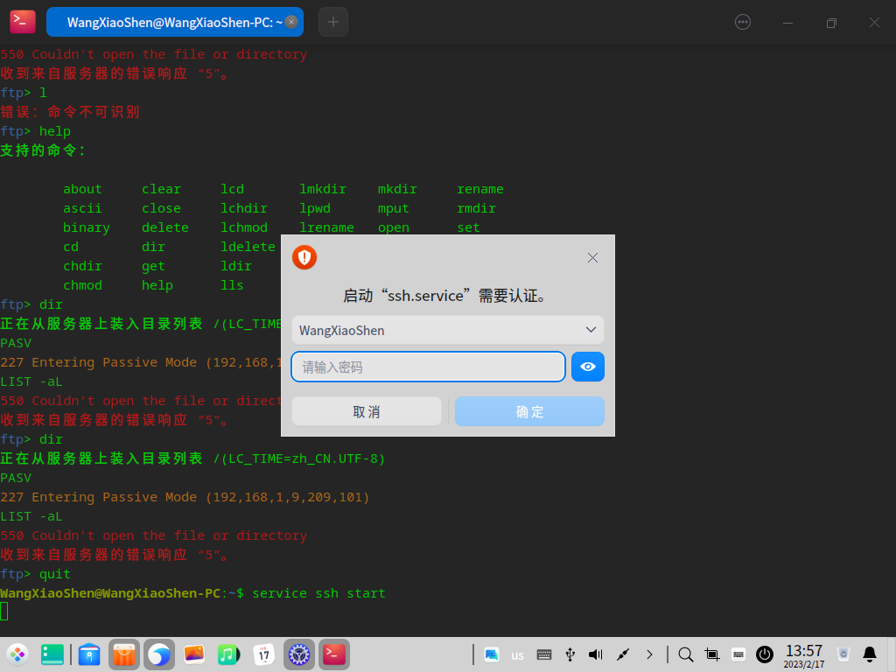
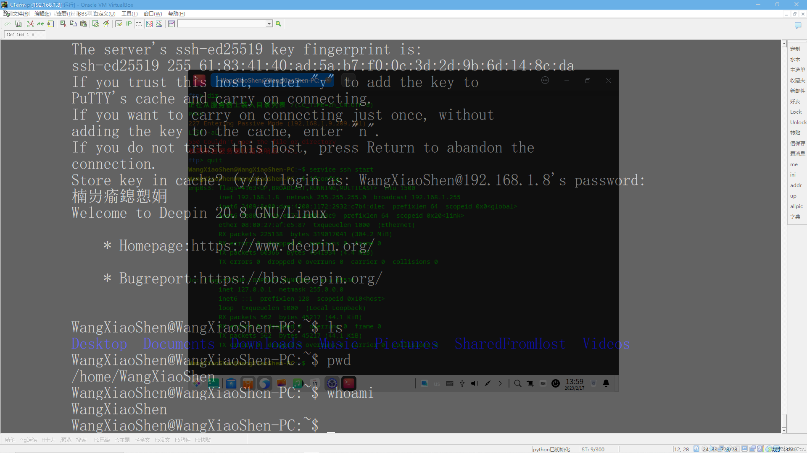
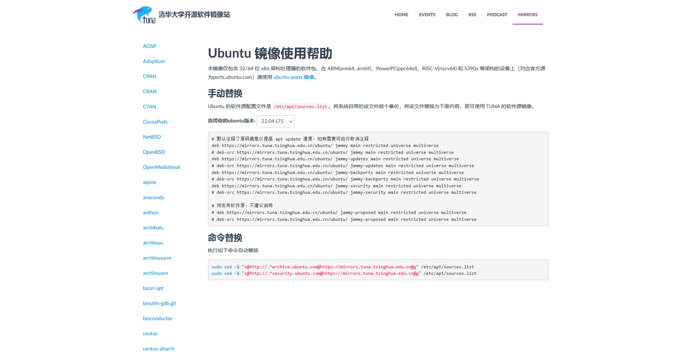
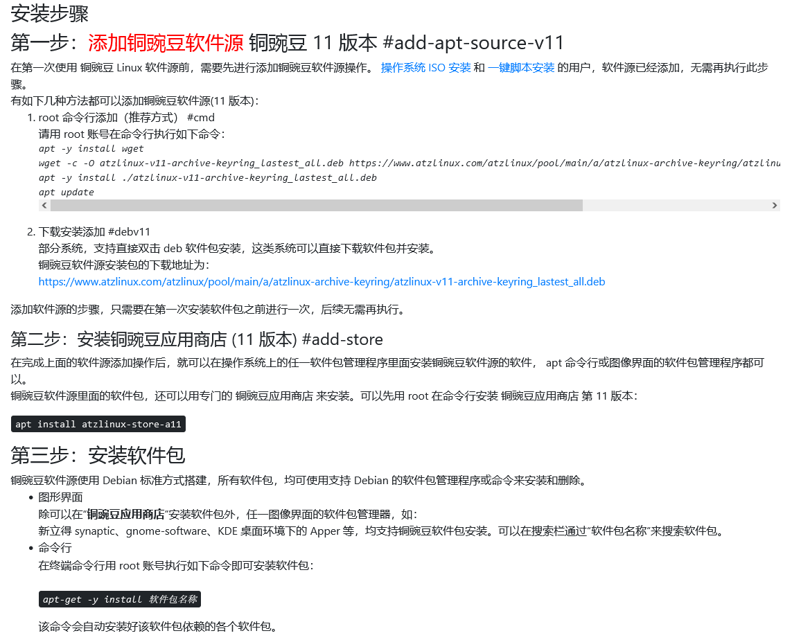
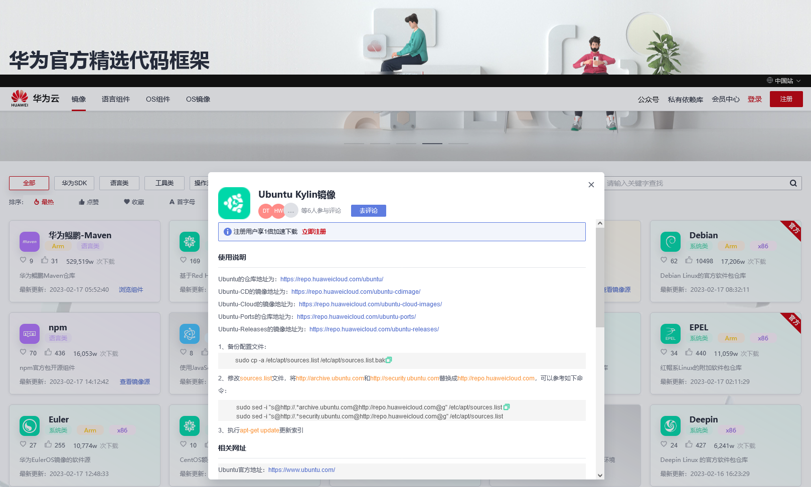
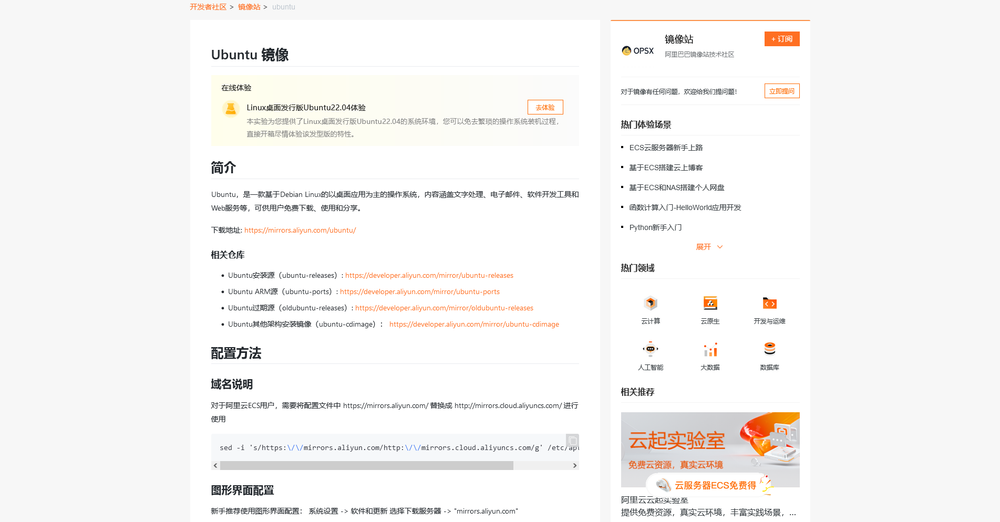
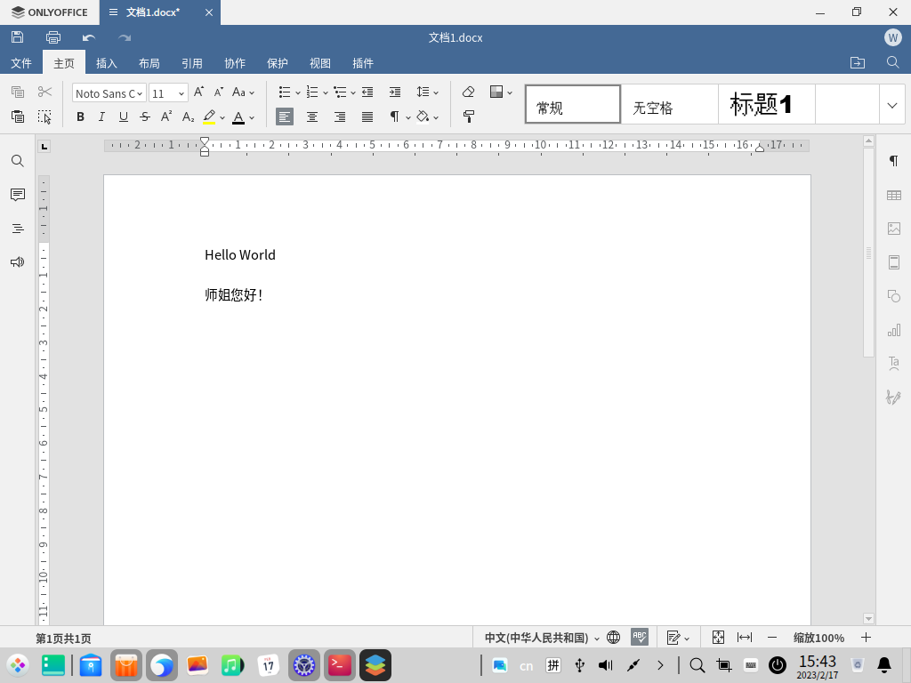

# 如何用VirtualBox虚拟机安装国产麒麟深度操作系统

不打嘴炮，这里开始折腾国产操作系统，麒麟和深度，而不去谈论评论这两款操作系统涉及嘴仗的东西。一说起虚拟机软件那就必然是VMware，但是个人使用的话，那只能找破解盗版的，对于我这样软件选择完全自由，不用向客户环境看齐的程序员，那就绝对推荐个人可以免费使用的VirtualBox这个开源软件。

首先是在深度和麒麟的官方网站下载到这两个操作系统的.iso安装光盘映像文件：


好在国产操作系统的官方网站都是中文的，这绝对比那些国外的Linux网站友好多了

在VirtualBox里面新建一个虚拟机：


如上图所示，在ISOImage栏内选择已经下载到本地的Linux光盘映像文件，然后下一步：


主机硬件性能高这里就可以高配一些，主机性能低的话这里就配置低一些，我安装虚拟机是为了安装ONLYOFFICE DOCS 7.3文档服务器，虚拟硬件的配置最好按照其推荐来配置，但是考虑到我的台式机硬件性能很低，我选择不听它的简易，拒绝推荐的配置，如上所示，这个虚拟机的虚拟硬件配置的非常的低。


为虚拟机创建一块虚拟硬盘，分配大了就会浪费，分配小了又怕不够用，比较纠结，我按照经验分配20G，再一次拒绝她的建议。


上述配置再确认一下，最后一次反悔的机会，点击下一步就真的开始创建这台虚拟机了：


别忘了可以在虚拟机的描述里面随便写写，我一般是在虚拟机系统安装好之后，在这里记录下给虚拟机系统设置的用户名和密码，方便以后使用虚拟机的时候不会忘了登陆密码


然后就可以点击右上角的启动按钮给虚拟机开机：


启动过程右侧栏会有一个透明栏，显示开机进度


注意看virtualbox虚拟机软件提示的操作切换键，一旦键盘鼠标把热点切换进虚拟机内，那么如何再切出虚拟机回到主机操作呢？就是有一个关键的切换键，在virtualbox里面默认的是右的ctrl按键


启动后是这样的，注意这里还并没有安装到硬盘上，而是Live CD启动的模式，也就是仅仅从虚拟光盘启动的临时系统，先让你体验一下，如果桌面环境很漂亮让人眼睛一亮就可以继续执行安装过程，安装到硬盘上，而如果体验不好，就可以拒绝安装说再见，比如如果你下载了一款国外的某个发行版的安装Live CD启动桌面后发现它辱华了，那就可以在这个环节直接关机扔了它。


无视虚拟机安装的深度Linux的空间不足警告，这只是Live CD临时体验模式


虚拟机特有的操作是，从主机端一侧，给虚拟机截图，这样，即使虚拟机处于纯粹的终端文字符命令行环境下无法自身截图的状态，也可以从主机端给其截图，如上图所示，Virtual Box默认的是右侧ctrl+E按键组合


桌面左侧有一列四个图标，其中最下面一个就是安装系统的图标，鼠标双击打开，现代Linux的安装全都是图形化向导化的界面，国产的发行版还提供中文选择，非常方便


选择时区


创建用户名、主机名、密码：


按照Linux系统的常用习惯，密码必不可少，即使设置为了开机自动登陆，即使用最简单的密码也不要留为空白，不然装好后很多东西操作不了


选择安装方式


对于虚拟机，由于是全新创建的一块虚拟硬盘，虚拟硬盘里面并没有已存的分区和有用的数据，所以我选择全盘安装。

而如果你不是在虚拟机里面安装而是在真实Windows电脑里面，为Linux创建了一块硬盘分区来安装Linux的双系统，那么你就需要选择自定义安装，仔细辨认，选择分给Linux的硬盘分区来安装，一定要小心不要误删Windows系统和分区的数据。


确认在虚拟机里面全盘安装后就真正执行安装过程了


安装完成，现在重启，吗？


重启之前先在虚拟机软件里面把虚拟机的虚拟光盘所加载的系统安装光盘退出来，否则虚拟机启动的时候可能又回到Live CD光盘系统环境了


弹不出来可以直接按光驱弹出键来强制弹出：


然后重启虚拟机：


作为程序员，才不会被任何error吓到，直接硬重启：


硬重启之后成功进入安装好的麒麟操作系统了


注意看，左侧一列只剩下三个图标了，最下面不再有安装系统的图标了，这说明该操作系统已经安装到虚拟机里面了

本文完！下期再见！

没完！其实上面的只是开胃菜，安装好后才是正经上菜。国内的Linux玩家使用者，在虚拟机里面安装Linux，一般都少不了要折腾这么几件必不可少的事情，不然就没法日常使用Linux办公、生活：

# 网络连接配置

虚拟机软件VirtualBox非常方便，只要真实主机自己能上网，那么默认的虚拟机就能直接自动连接互联网。需要确认配置的，是虚拟机和主机之间要能互相直接连通，经过测试，默认的网络连接配置下，真实的Windows主机无法ping连通虚拟Linux主机，因此需要修改虚拟机的网卡连接方式，从默认的NAT模式修改为桥接网卡：


这样就是让虚拟机与主机并列，直接从主机所连接的路由器上获取动态ip地址，与真实主机成为同一个局域网。在Linux系统下用ifconfig命令查看所获取到的ip地址：


这是我的安装了国产深度Linux操作系统的虚拟机，获取到的ip地址如图所示为`192.168.1.8`，然后可以和主机、以及其它的虚拟机互相ping测试是否连通


如上图所示，自己同时开启了两个虚拟机，左侧为国产深度Linux操作系统，右侧为国产麒麟操作系统，最上层透明显示的是真实Windows主机的终端Conemu，三者互相都能ping通。

做好连通配置之后，就可以在国产Linux操作系统上安装配置各种各样的网络服务应用了，比如一台安装NextCloud、Seafile之类的私有云，另一台安装ONLYOFFICE私有云办公服务，再将两者互联互通互操作，那么我的这一台真实Windows主机，以及同一个Wifi路由器下面的其它电脑，就都可以访问使用自己的这些私有云服务了。

# 文件互通配置

搞定虚拟机和主机之间的连通之后，就要搞定文件互通，比如要把真实主机Windows系统下的一个文件拷贝进虚拟机Linux里面，或者把虚拟机Linux下面的一个文件拷贝出来，正经的做法或者说传统的做法是配置Linux文件共享Samba服务，功能最为强大，有经验的Linux维护管理员可能会为了简单而仅仅是在虚拟Linux里面开一个ftp服务器，用该服务器来做文件互通使用。

毕竟ftp是互联网最早最基础的应用层协议之一，任何Linux发行版本、任何Windows版本、任何苹果MacOS版本、甚至所有的智能手机系统，都默认的可以从自身的文件管理器作为ftp客户端发起连接，连接到ftp服务器端去下载文件和上传文件。

当然，很多人非常惧怕Linux下安装配置各种复杂服务，那么就再简化一个层次，在真实主机Windows系统里开ftp服务，比如自己直接使用我的文件搜索工具软件Everything自带提供的ftp服务


非常方便，当然该ftp服务是只提供下载不提供上传功能，如果要从虚拟Linux中向真实Windows主机传文件，那么可以在真实Windows主机上安装一个免费开源的ftp服务管理软件[firezilla](https://filezilla-project.org/)


在真实Windows主机上安装下载FileZilla服务器端软件，直接自带提供中文界面，向导式设置，即可开通下载上传的权限，让虚拟Linux系统可以向真实Windows主机传送文件，尤其自己这种一个真实Windows主机，两台虚拟Linux机，与其在两台虚拟机里面各安装配置一个ftp服务，不如在真实Windows主机里只需要装一个ftp服务。

需要注意的是，在Windows10系统电脑上，默认是有防火墙堵断了ftp连接的端口号，因此需要进入Windows系统的防火墙设置里面，将ftp服务的几个规则打开一下：


然后即可在虚拟机Linux中使用ftp客户端软件连接并进行文件的双向传输了：



# sshd终端连接服务

在真实生产环境中Linux系统大多是不开启桌面环境的，更为稳定安全，对其的运维是从局域网内的工作主机ssh连接上去的，这需要服务器开通sshd加密安全连接服务功能，如果你没有看懂这句话的话说明不需要，可以跳过这一节，如果有需要的话，那么就可以先尝试一下启动命令是否能启动ssh服务：

```bash
service ssh start
```

根据网上搜索到的资料说深度默认是没有安装ssh服务的，但是尽信书则不如无书，自己直接暴力尝试上述命令启动，果然得到下面的画面



幸运的，自己安装的这个版本已经自带了ssh，只需要上述命令启动即可，然后就可以在真实Windows主机，或者网络内其它计算机上ssh远程登陆该Linux服务器了：


我使用最顺手的cterm工具连接，自动弹出用户名密码对话框就说明连接成功了，然后进入：



这样就打通了VirtualBox虚拟机下国产Linux和主机之间的网络连接、文件互通、操作互通了，这个Linux已经可以基本日常使用，还有可能其它版本的Linux没有安装ssh服务，则安装的脚本是：
```bash
sudo apt install openssh-server
```
 
# 软件源配置
老生常谈的几个国人使用Linux的常见问题，如果用国外发行版，则默认的软件源的服务器都在国外，网速非常慢，因此国内有不少的有层次的互联网大企业在国内做了镜像，国内Linux使用者安装国外发行版Linux之后第一件事就是修改配置使用国内的软件源，可以加快安装配置升级各种生产力软件的效率。而现在随着国产发行版的流行，麒麟、深度等，使用者就可以直接使用系统自带的各个发行版自己的软件市场来安装更新各种软件了，但是，国内的应用软件市场上架的软件列表，实在难以让人恭维了，打住，这里不予吐槽，因此，还是推荐大家如果有需要的话，还是添加几个生产力软件收纳比较全的软件源：
## 清华源

全称是[清华大学开源软件镜像站](https://mirrors.tuna.tsinghua.edu.cn/)，从首页找到帮助页面，然后按照Linux不同的发行版本有不同的具体页面，那么，国产的深度Linux、麒麟Linux就对应的应该选择Ubuntu发行版本的帮助说明

[Ubuntu 镜像使用帮助](https://mirrors.tuna.tsinghua.edu.cn/help/ubuntu/)


## 铜豌豆软件源
[铜豌豆软件源](https://www.atzlinux.com/index.htm)

国内唯一没有拉大旗扯虎皮的纯粹的开源情怀的发行版与软件源



## 华为开源镜像站
[华为开源镜像站](https://mirrors.huaweicloud.com/home)
强烈推荐，华为源直接提供国产麒麟和深度Linux发行版的软件源



## 阿里源
全称是[阿里云官方镜像站](https://developer.aliyun.com/mirror/)，从首页点进Ubuntu操作系统，然后按照说明修改软件源：

[Ubuntu 镜像](https://developer.aliyun.com/mirror/ubuntu?spm=a2c6h.13651102.0.0.3e221b11mgeeBU)



## 中科大源
[Another infinity](https://mirrors.ustc.edu.cn/)

## 网易源

[欢迎访问网易开源镜像站](http://mirrors.163.com/)

## 搜狐源

[搜狐源](http://mirrors.sohu.com/)

# 中文输入法

这就是我强烈推荐使用国产Linux发行版的原因了，用国外发行版的Linux，安装配置中文输入法就是一个大坑，而国产的任何一款Linux都已经替我们普通使用者填平了这个大坑。

# 改换Office软件

国外的Linux发行版，很多安装的是LibreOffice，只有少数预装ONLYOFFICE才比较好用，国内的Linux，麒麟预装的是WPS，非常好用，深度预装的居然也是LibreOffice，这就不能忍了，在深度自带的软件市场里面既能看到WPS，也能看到ONLYOFFICE，于是果断选择没有广告满天飞的ONLYOFFICE了：


装好后打开界面干净清爽，功能强大：



# 安装配置木弟子

即使如上面所述配置了软件源，也还是会经常遇见小众生产力软件不被主流大众软件源包含的情况，而这种生产力软件的官网又往往在伟大的墙之外，还是不得不去安装一个翻墙软件，去国外学习先进生产力，目前为止，适合于Linux客户端的目的子的软件推荐[V2rayA](https://v2raya.org/)，还有[Clash](https://github.com/Dreamacro/clash)，这也是远远难于上面所涉及的所有操作，这种事情就是玄学，究竟能不能翻过去，就看个人造化了，因此这里略去

# 总而言之

言而总之，这只是一个引子，之后再推更深入的开发使用的攻略图文，就不再科普这些基础技能了，之后再有人问我相关的问题，自己就直接把这篇文章甩给他看了。

