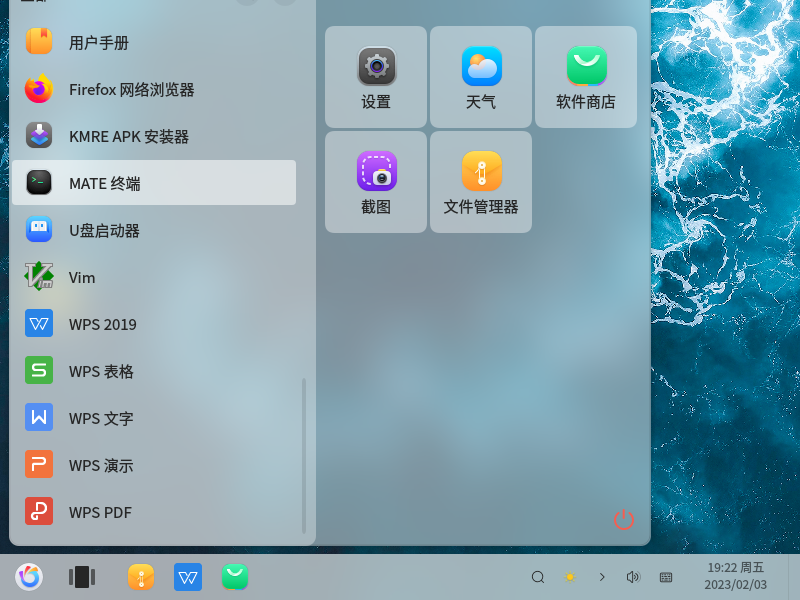
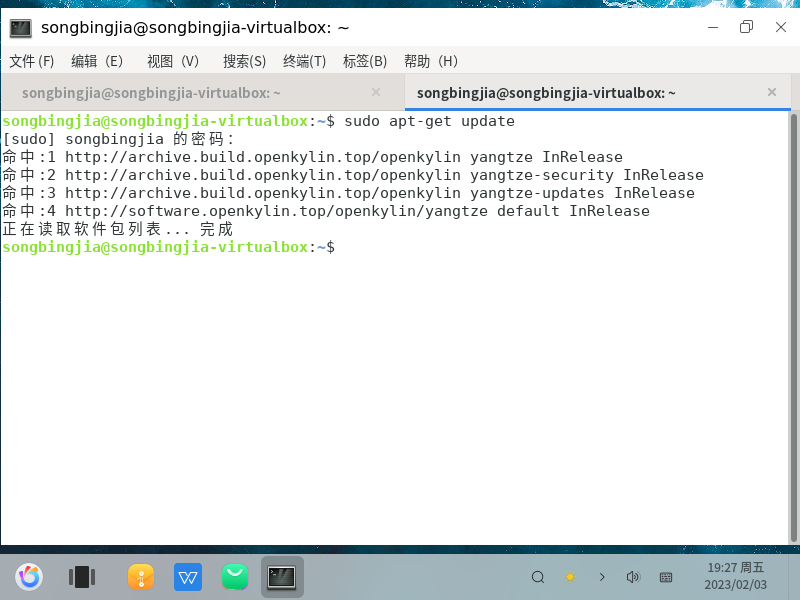

---
export_on_save:
  pandoc: true
title: "在国产麒麟操作系统上如何安装ONLYOFFICE Docs 7.3"
author: 天哥
date: Feb 2, 2023
output: word_document
---
# 在国产麒麟操作系统上如何安装ONLYOFFICE Docs 7.3

这里假定你已经安装好了国产的麒麟操作系统，别管是在真实的物理机器上安装的，还是virtualbox、vmware虚拟机里面安装的，在该电脑上安装ONLYOFFICE Docs文档服务器。作为服务器使用，麒麟与任何普通的Linux操作系统一样，是可以不开启桌面模式的，强烈推荐服务器模式

