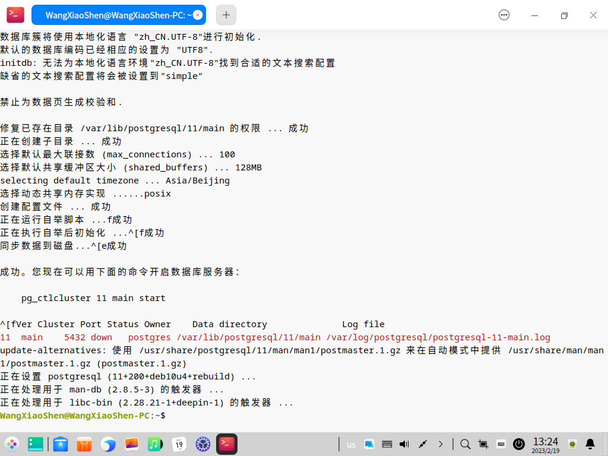
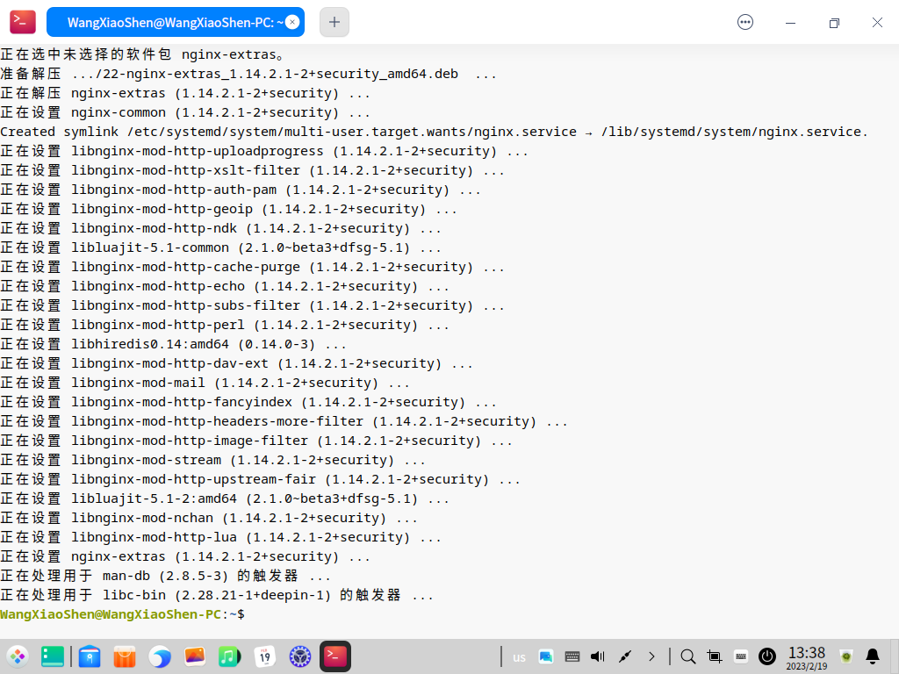
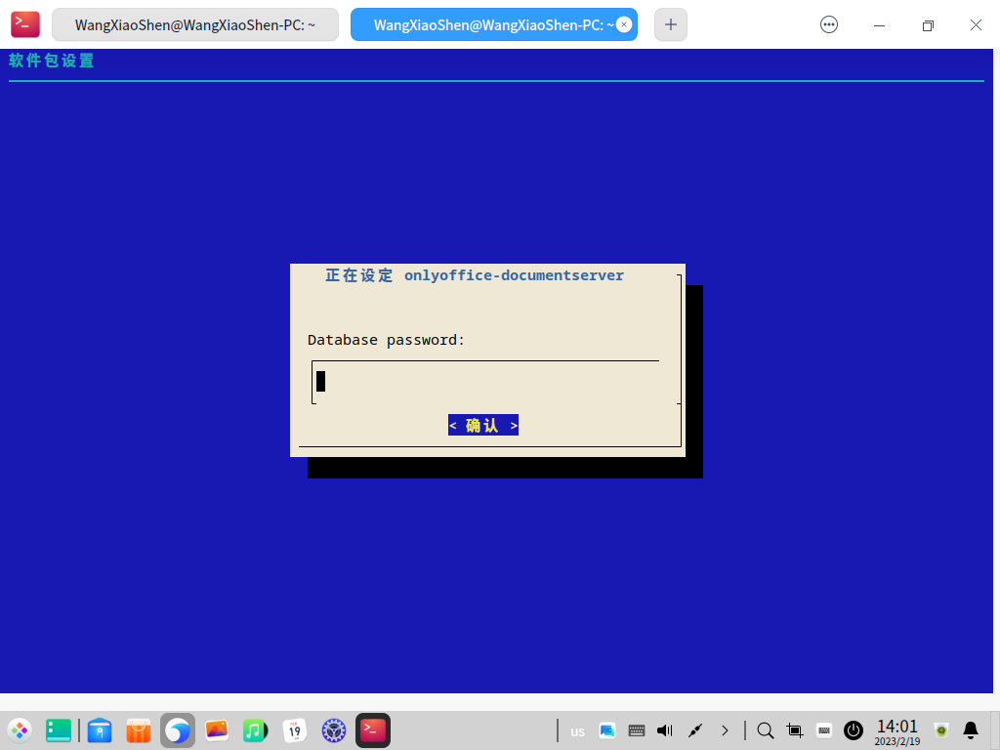
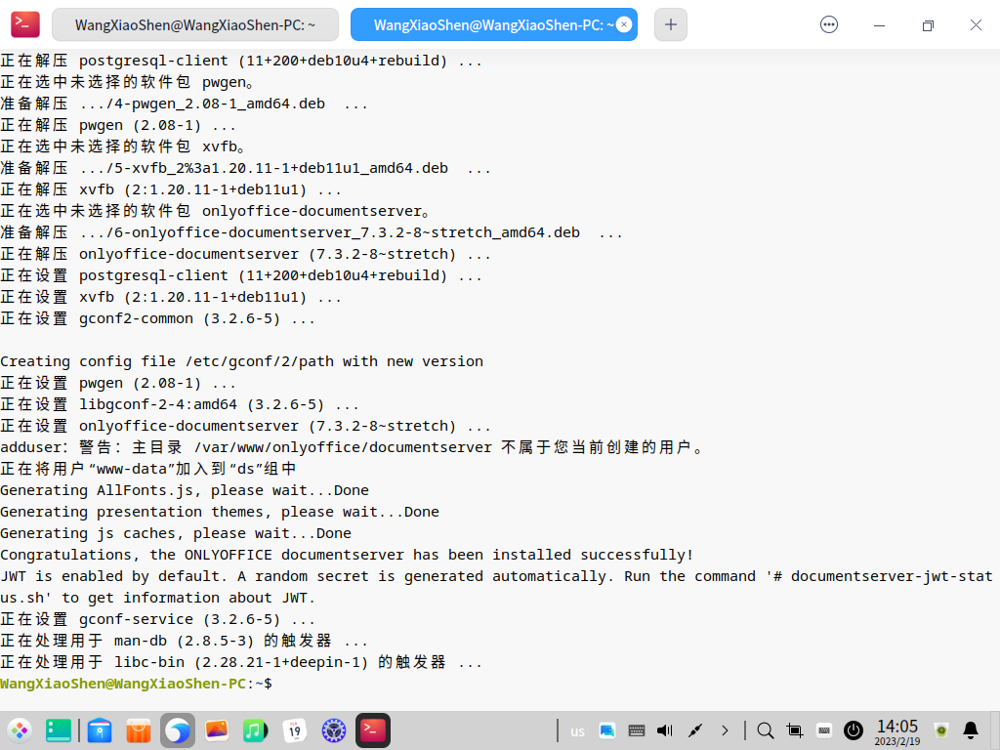

---
export_on_save:
  pandoc: true
title: "在国产深度操作系统上如何安装ONLYOFFICE Docs 7.3"
author: 天哥
date: Feb 19, 2023
output: word_document
---

# 在国产深度操作系统上如何安装ONLYOFFICE Docs 7.3


在二月初，ONLYOFFICE发布更新了最新的7.3版本。新版本提供了高级表单、SmartArt图形插入、增强密码保护和公式计算、幻灯片特殊粘贴项等多项新功能。同时发布了服务器端的文档服务器和客户端的桌面编辑器的最新7.3版本。


上一期介绍了其服务器端的文档服务器如何在国产的麒麟操作系统上安装：

[在国产麒麟操作系统上如何安装 ONLYOFFICE Docs 7.3](https://mp.weixin.qq.com/s?__biz=MzI2MjUyNzkyNw==&mid=2247504088&idx=1&sn=bd04ee743fcdfa8e0c775740b23ddca5&chksm=ea4b5e00dd3cd7166ad7940531faeb4ab1168686cea5e0c1f1979d450d3c65e25ab20caae3bb&token=126663539&lang=zh_CN#rd)

这里继续，讲解其服务器端的文档服务器如何在国产的深度操作系统上安装，而客户端的安装使用下一期再仔细讲解。

至于Linux操作系统如何安装部署，选择真实物理计算机还是在虚拟机软件里面安装，安装桌面环境还是不安装桌面环境仅仅安装为服务器模式，Linux安装好后一般都要先安装那些必要的软件源，等等Linux的基础问题，我都写在另外一篇攻略图文里面了。

[如何用 VirtualBox 虚拟机安装国产的麒麟、深度等操作系统](https://mp.weixin.qq.com/s?__biz=MzI2MjUyNzkyNw==&mid=2247504038&idx=1&sn=369862bae372347f438ca3b882137eb2&chksm=ea4b5e7edd3cd768b7e9cc5e73ea487a91734024e1fa7da638d533e3d0f6953962fb1c8d0e35#rd)

## 安装ONLYOFFICE文档服务器的系统需求：

|            |                                                              |
| ---------- | ------------------------------------------------------------ |
| CPU        | 双核2Ghz                                                     |
| 内存       | 2G                                                           |
| 硬盘       | 40G                                                          |
| SWAP       | 4G                                                           |
| OS         | 64位Debian、Ubuntu或其他发行版，内核版本号3.13以上 |
| PostgreSQL | 12.9                                                         |
| NGINX      | 1.3.13                                                       |
| libstdc++6 | 4.8.4                                                        |
| RabbitMQ   |                                                              |

## 使用终端文字符

这里假定你已经安装好了国产的深度操作系统，在该电脑上安装ONLYOFFICE Docs文档服务器。我从官方网站下载的深度操作系统安装光盘默认安装Desktop桌面环境，既来之则安之，我也就默认安装了桌面环境，因此下面的众多截图你们可以看见是在桌面环境下，但即使如此，大部分操作也还是在桌面环境下打开的终端程序里面来操作的，如下图所示从开始菜单找到Mate终端打开：


作为服务器的正经操作，应该是远程通过terminal类程序ssh登陆服务器在终端中各种操作。

## 在线安装指南

深度操作系统的官方软件市场是能够搜到ONLYOFFICE的的客户端桌面版编辑器的，而服务器端Doc Server文档服务器是没有的，那么，还是需要像在麒麟操作系统下一样，自己手动安装ONLYOFFICE的文档服务器了，按照一般的Debian、Ubuntu系列的发行版的方式来安装，在ONLYOFFICE官方网站找到服务器端下载安装页面：

[下载ONLYOFFICE文档社区版](https://www.onlyoffice.com/zh/download-docs.aspx?from=default#docs-community)


选择第二条，在Debian、Ubuntu及其派生发行版上安装，选择Intel的CPU，因为一般的服务器的CPU都是Intel的，而ARM的CPU一般用在手机上或pad平板上，点击后打开其安装指南网页页面，按照说明执行安装：

[Installing ONLYOFFICE Docs Community Edition for Debian, Ubuntu, and derivatives](https://helpcenter.onlyoffice.com/installation/docs-community-install-ubuntu.aspx?_ga=2.136308209.110839153.1675419797-433964955.1670329690)


纯英文的看不懂？中文版本的可以参考上一个版本7.2版本的我写的安装攻略：

[如何在 Fedora Linux 上安装 ONLYOFFICE Docs 7.2](https://mp.weixin.qq.com/s?__biz=MzI2MjUyNzkyNw==&mid=2247503100&idx=1&sn=c98e427295781ec40e77291b72f705d4&chksm=ea4b4224dd3ccb324863728afdbd9de470dfff5e1709bf7f3ef518d81a6abc83c71d466f78f2#rd)

## 安装依赖项

### Postgresql

按照上述官网安装手册网页说明，先安装所依赖的软件postgresql：

```bash
sudo apt-get install postgresql
```



深度操作系统自身的软件市场源可以直接搜索安装postgresql，比麒麟的好用多了

接下来*postgresql*安装好后创建并配置ONLYOFFICE文档服务器的数据库和系统用户：

```bash
sudo -i -u postgres psql -c "CREATE DATABASE onlyoffice;"
sudo -i -u postgres psql -c "CREATE USER onlyoffice WITH password 'onlyoffice';"
sudo -i -u postgres psql -c "GRANT ALL privileges ON DATABASE onlyoffice TO onlyoffice;"
```


### Rabbitmq-server

然后安装ONLYOFFICE依赖的另一个软件：*rabbitmq-server*兔子服务器

```bash
sudo apt-get install rabbitmq-server
```


### Nginx-extras

再安装*nginx-extras*

```bash
sudo apt-get install nginx-extras
```


## 可以设置不同的端口号

如果你的文档服务器上的端口号80已经被其他服务占用了，那么你可以修改ONLYOFFICE服务器的端口号

```bash
echo onlyoffice-documentserver onlyoffice/ds-port select <PORT_NUMBER> | sudo debconf-set-selections
```

在该命令中把 `<PORT_NUMBER>`替换为你要修改到的端口号即可。

如果要改变设置https端口号，不要改到443，请参考下列手册配置：

[如何在 Ubuntu 上将 ONLYOFFICE 文档切换至 HTTPS 协议](https://blog.csdn.net/m0_68274698/article/details/126122198)

## 安装GPG key密钥

```bash
mkdir -p -m 700 ~/.gnupg
gpg --no-default-keyring --keyring gnupg-ring:/tmp/onlyoffice.gpg --keyserver hkp://keyserver.ubuntu.com:80 --recv-keys CB2DE8E5
chmod 644 /tmp/onlyoffice.gpg
sudo chown root:root /tmp/onlyoffice.gpg
sudo mv /tmp/onlyoffice.gpg /usr/share/keyrings/onlyoffice.gpg
```


## 安装ONLYOFFICE DOCS文档服务器

添加ONLYOFFICE DOCS官方软件源

```bash
echo "deb [signed-by=/usr/share/keyrings/onlyoffice.gpg] https://download.onlyoffice.com/repo/debian squeeze main" | sudo tee /etc/apt/sources.list.d/onlyoffice.list
```


刷新软件源：

```bash
sudo apt-get update
```


安装mscorefonts

```bash
sudo apt-get install ttf-mscorefonts-installer
```


安装ONLYOFFICE DOCS：

```bash
sudo apt-get install onlyoffice-documentserver
```


看到提示它将下载这么大体积的数据，是不是就可以离开电脑去看电视剧狂飙了呢？不要走开！因为这个安装过程中会出现这么一个对话框需要手动填写继续的：



输入之前安装依赖项postgresql时候创建的数据库的名称和密码，如果严格按照此片攻略操作没有设定不同的密码的话，是onlyoffice，确认下一步后稍后即可安装完成。



装好后如何查看使用呢？自己的深度操作系统是安装了桌面环境的，于是打开自带的火狐浏览器，输入本地地址*http://localhost*即可打开ONLYOFFICE DOCS文档服务器的欢迎首页了：


如果是通过纯文字终端安装在服务器上，从本地客户端打开网页浏览器访问服务器，则需要在服务器端输入ip地址查询命令ifconfig来查询服务器的ip：


然后可以在网络上的客户端电脑比如Windows电脑上连接过来：


如果想先测试编辑器功能，请点击Go to test example按钮。这将会打开一个网页，在这里就可以创建示例内容文档（不要在这个环境下写入真实生产环境敏感数据）

ONLYOFFICE DOCS 7.3文档服务器最终完成！现在就可以把ONLYOFFICE Docs集成到你现有的服务平台上了，并开始在网络文档上协同编辑了！
