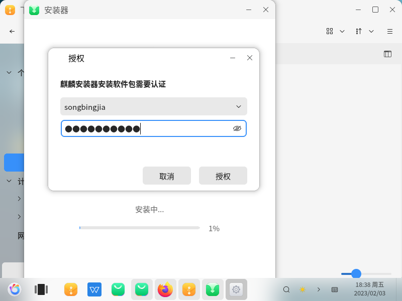
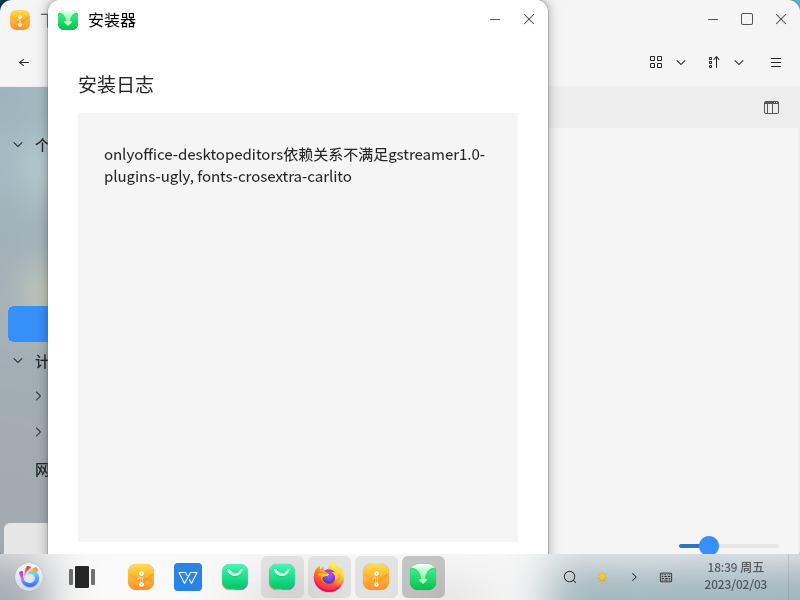
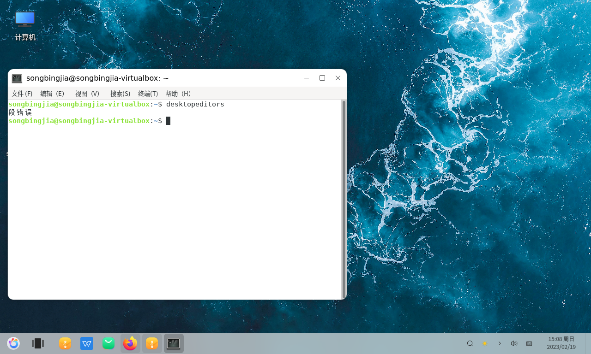
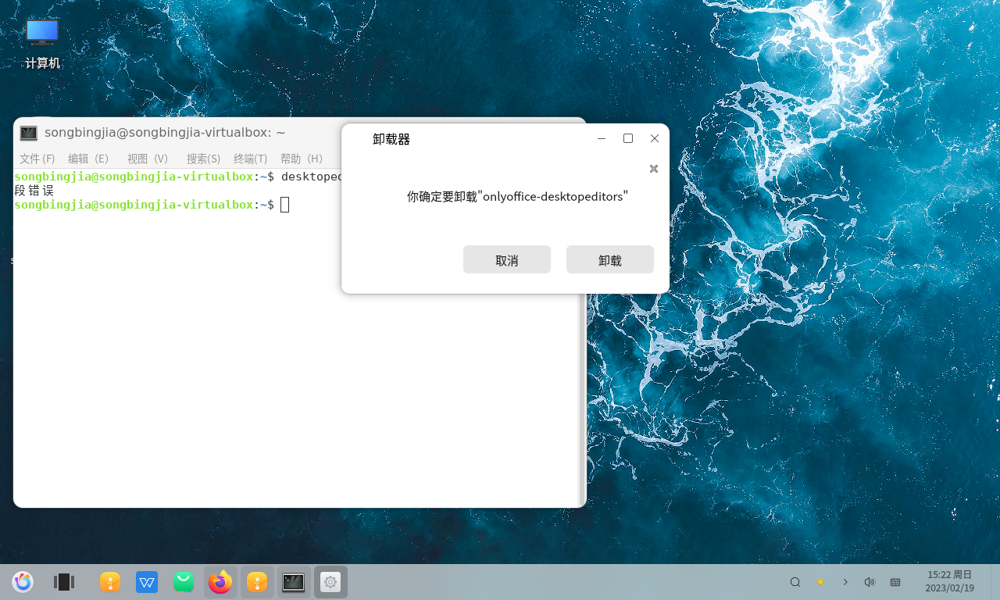
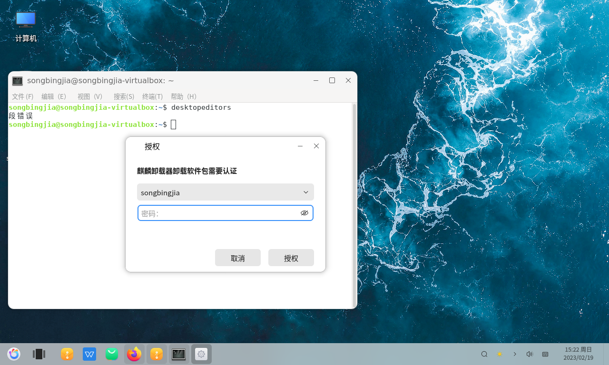

---
export_on_save:
  pandoc: chan
title: "在国产麒麟操作系统上如何安装ONLYOFFICE桌面编辑器V7.3"
author: 天哥
date: Feb 19, 2023
output: word_document
---

# 在国产麒麟操作系统上如何安装ONLYOFFICE桌面编辑器V7.3

[在国产麒麟操作系统上如何安装 ONLYOFFICE Docs 7.3](https://aesuib.github.io/OnlyOfficeBlogs/026%20How%20to%20install%20ONLYOFFICE%20Docs%207.3%20on%20NeoKylin/%E5%9C%A8%E5%9B%BD%E4%BA%A7%E9%BA%92%E9%BA%9F%E6%93%8D%E4%BD%9C%E7%B3%BB%E7%BB%9F%E4%B8%8A%E5%A6%82%E4%BD%95%E5%AE%89%E8%A3%85ONLYOFFICE%20Docs%207.3.html)

之前的推文介绍过，如何把国产麒麟操作系统作为服务器端，安装ONLYOFFICE文档服务器V7.3版本


ONLYOFFICE作为完整的办公解决方案，其每次升级，都是云端服务器程序和客户端桌面编辑器基本上是同时更新发布新版本的，二月初7.3版本发布后，桌面版编辑器也升级了，这里就继续，讲解在把麒麟操作系统作为个人电脑使用的时候，如何安装ONLYOFFICE的桌面版编辑器。

# 从系统自带的软件市场安装

Linux操作系统安装软件最简单的方式就是，从其自带的软件市场里搜索安装，与深度操作系统自带市场能直接搜索到ONLYOFFICE桌面编辑器不同，麒麟操作系统自带市场是搜索不到ONLYOFFICE桌面编辑器的。

自己的虚拟机里面的麒麟操作系统，自己先前手动从文字符终端下用aptget命令安装配置了ONLYOFFICE DOC文档服务器了的，参见之前图文：

[在国产麒麟操作系统上如何安装 ONLYOFFICE Docs 7.3](https://aesuib.github.io/OnlyOfficeBlogs/026%20How%20to%20install%20ONLYOFFICE%20Docs%207.3%20on%20NeoKylin/%E5%9C%A8%E5%9B%BD%E4%BA%A7%E9%BA%92%E9%BA%9F%E6%93%8D%E4%BD%9C%E7%B3%BB%E7%BB%9F%E4%B8%8A%E5%A6%82%E4%BD%95%E5%AE%89%E8%A3%85ONLYOFFICE%20Docs%207.3.html)

然后就发现自己的这个麒麟虚拟机的软件市场无法打开了，不但如此，自带的WPS也无法打开了，幸好系统自带的终端和Firefox火狐浏览器还能正常使用，于是正好尝试安装ONLYOFFICE桌面编辑器最新V7.3版本了。

# 从ONLYOFFICE官方网站下载.DEB格式的安装包

麒麟操作系统从Debian、Ubuntu派生而来，因而支持可以安装.deb格式的软件安装包。找到下载网址：

[为您的桌面与移动设备下载免费ONLYOFFICE应用](https://www.onlyoffice.com/zh/download-desktop.aspx)


最前面两个是Ubuntu操作系统版本的安装下载，依据你的系统版本号下载：


下载后的文件：


直接双击即可打开安装器：


一键安装，输入密码：



然后就报告缺失依赖项的错误了：




幸好在下载网页上看到有高低两个不同版本号Ubuntu的.deb安装包，于是换一个版本安装：


似乎就可以成功安装了，吗？


Linux下面安装.deb包的事情大概是个玄学，可能成功也可能失败，我这里装不上不一定你那里就装不上，所以我建议你还是试过所有两个版本的.deb包来安装ONLYOFFICE之后再放弃这种安装方式。比如我，虽然安装成功了，但是从开始菜单点击其图标是启动不起来ONLYOFFICE桌面编辑器的，于是从文字符下面用命令的方式来启动它，这才发现问题的所在：



给不太懂C语言的程序员和中文不太好的程序员解释一下，这就是英文原文`Segment Fault`的中文翻译，就是内存跑飞了的意思，自己也不知道哪里的内存泄露了，反正就是这两个.deb格式的安装包在自己的麒麟虚拟机上都安装不成功了，段错误是最难解的bug之一了，也是最玄学的bug之一了，在我这里存在，在你那里也许就不存在，所以还是推荐你试一下用deb安装包，万一成功了呢？

在尝试使用aptget命令安装桌面编辑器之前，先从桌面上卸载安装不成功的桌面编辑器：


卸载非常简单，从开始菜单找到它右键卸载即可



卸载需要确认还需要输入密码



# 从repository中安装桌面编辑器

只有前面的几个方法都不管用再来尝试这种安装方法，因为据说很多初次尝试国产Linux的同学都很惧怕命令行文字符敲命令的操作，只用鼠标就能操作电脑该多好！

自己因为之前已经安装配置好了ONLYOFFICE文档服务器在自己的这台麒麟操作系统上，因此自己尝试了一下直接走最后一个步骤命令安装桌面编辑器：

```bash
sudo apt-get install onlyoffice-desktopeditors
```


居然直接就可以安装了！

而对于一般使用者来说，自己的麒麟桌面操作系统只是初次安装系统初次安装桌面编辑器，则需要先：

## 1. 安装GPG密钥

在命令行里面输入如下命令：

```bash
mkdir -p -m 700 ~/.gnupg
gpg --no-default-keyring --keyring gnupg-ring:/tmp/onlyoffice.gpg --keyserver hkp://keyserver.ubuntu.com:80 --recv-keys CB2DE8E5
chmod 644 /tmp/onlyoffice.gpg
sudo chown root:root /tmp/onlyoffice.gpg
sudo mv /tmp/onlyoffice.gpg /usr/share/keyrings/onlyoffice.gpg
```

终于明白为什么我们程序员都很喜欢攀比追求高质量键盘了吧，因为我们认为用鼠标操作从桌面的一个像素点移动到另一个像素点是需要右手的大幅度的运动的并且还是模糊不精确的，而键盘则可以盲打，再加上快捷键和系统软件的自动补全功能则会非常高效的，比如上述这几个命令，并不需要手动敲进去，而是在安装帮助中直接复制ctrl+c出来的，再在命令行里面粘贴ctrl+v进去执行的，比如本文的网址URL就是

[在国产麒麟操作系统上如何安装ONLYOFFICE桌面编辑器V7.3](http://Aesuib.github.io/OnlyOfficeBlogs/在国产麒麟操作系统上如何安装ONLYOFFICE桌面编辑器V7.3.html)

打开复制就行了！

## 2. 添加软件repository

```bash
echo 'deb [signed-by=/usr/share/keyrings/onlyoffice.gpg] https://download.onlyoffice.com/repo/debian squeeze main' | sudo tee -a /etc/apt/sources.list.d/onlyoffice.list
```

## 3. 刷新一下缓存

```bash
sudo apt-get update
```

## 4. 安装软件本体

就是最后一步：

```bash
sudo apt-get install onlyoffice-desktopeditors
```

然后就是执行安装过程了


既然是软件本身的官方安装源，这种正经的办公软件其体积大小不会很小，国内的对国外的网络连接速度，不会太快，这就需要等，似乎可以去喝茶看电视剧狂飙了，吗？

**不要走！** 彩蛋来了，就在这里：


麒麟操作系统默认的屏保锁屏程序这是，再稍后片刻，安装完成：


在文字符下安装成功后并不会弹出一个提示框提醒你，而仅仅就是没有错误信息提示罢了，如上图所示，除了文字符下用```desktopeditors```命令启动之外，在开始菜单中也能找到，打开后，高仿的微软office界面又回来了！


然后就可以愉快的在麒麟系统下打开编写docx文档了，或者再连接到内网的ONLYOFFICE文档服务器上协同办公了！

