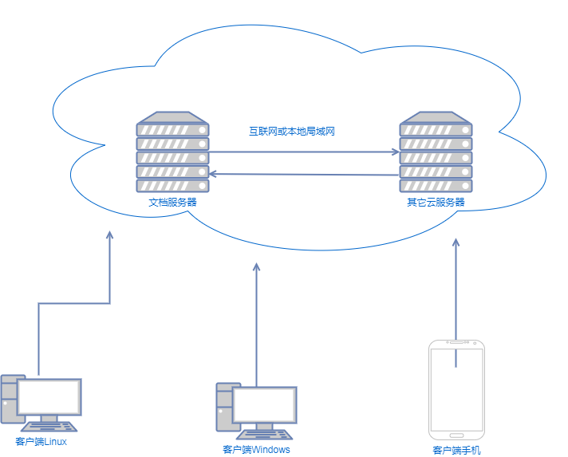

---
export_on_save:
  pandoc: chan
title: "在国产深度操作系统上如何安装ONLYOFFICE桌面编辑器V7.3"
author: 天哥
date: Feb 19, 2023
output: word_document
---

# 在国产深度操作系统上如何安装ONLYOFFICE桌面编辑器V7.3

之前我们讲过了如何在国产麒麟操作系统上安装ONLYOFFICE桌面编辑器V7.3

// todo insert the link

现在继续，国产的深度操作系统，这就要稍微简单些，首先，在ONLYOFFICE官网上有英文版本的深度系统安装指南：

[Installing ONLYOFFICE Desktop Editors on Deepin](https://helpcenter.onlyoffice.com/installation/desktop-install-deepin.aspx)
所以，这里我写此文的意义就是给那些不爱看英文的读者朋友们看的帮助，

注意这里说的不是服务器端的安装，把深度Linux系统作为服务器，安装ONLYOFFICE的文档服务器，这件事我已经写过一篇文章，在这里：

// insert the link

这里是真正把深度操作系统作为桌面操作系统，给具体干活的人直接使用，在该电脑上具体的写文档或者其它的生产活动，这里安装的就是ONLYOFFICE桌面编辑器软件。

## 从系统自带的软件市场安装

类似的，先尝试最简单的安装方式，从其自带的软件市场里搜索安装，直接搜索到ONLYOFFICE Desktop Editor

看看说明，下载次数真的很少，但是这么少的下载次数，评价得分却不低，足以见得它还是很好用的

该图截图的时候，今年1月份，ONLYOFFICE还没有发布7.3版本，而现在就应该可以直接安装7.3版本了。点击安装即可

深度的自己的市场平台的服务器肯定是在国内，所以下载安装的过程非常的快

安装好之后就可以看见在系统桌面上增加了一个图标，ONLYOFFICE，直接双击就可以打开运行了：

安装完成！

其它的安装方法，什么添加ONLYOFFICE的软件源、下载安装文件什么的，就统统都不需要了，直接在深度系统自己的软件市场就一切操作都搞定了

