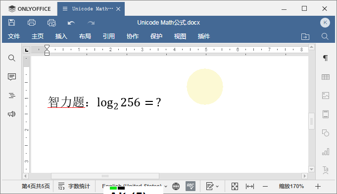
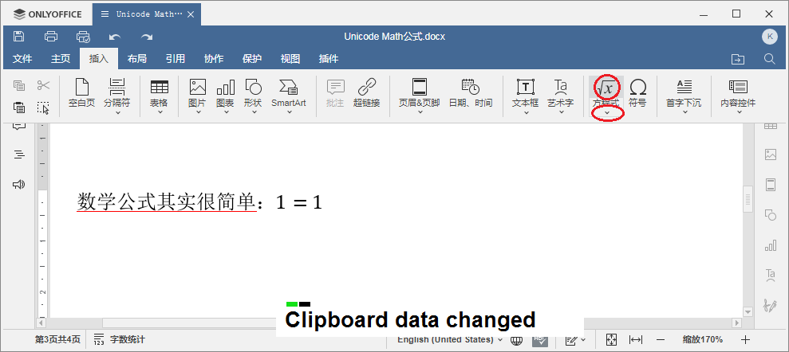
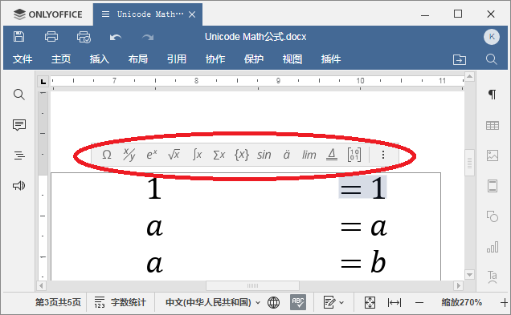
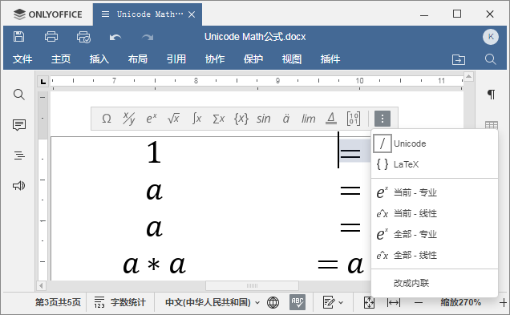
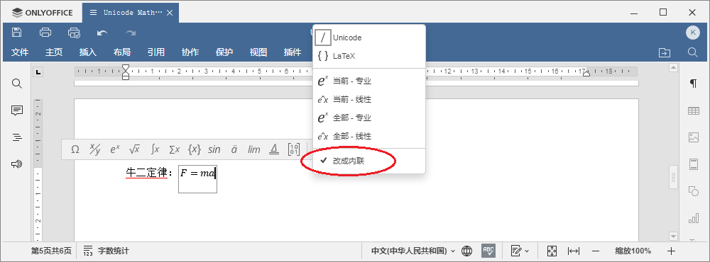
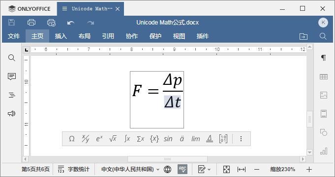
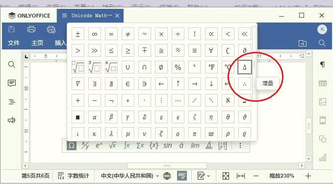
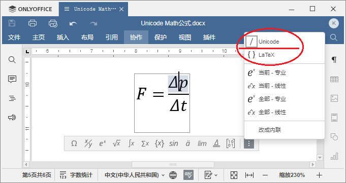
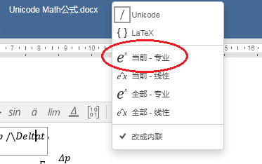
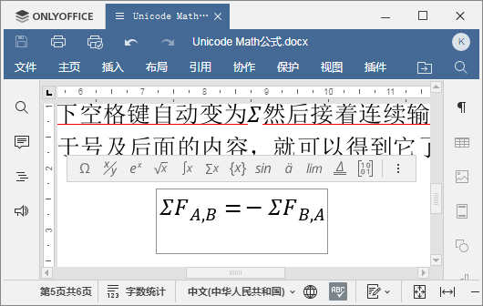

---
export_on_save:
  pandoc: chan
title: "如何使用UnicodeMath或LaTex在ONLYOFFICE中编写公式"
author: 天哥
date: Feb 24, 2023
output: word_document
---

# 如何使用UnicodeMath或LaTex在ONLYOFFICE中编写公式

[TOC]

在之前的文章中介绍了ONLYOFFICE最新更新的V7.3版本的新特性：

[ONLYOFFICE文档v7.3版本携新增功能发布了！](https://mp.weixin.qq.com/s?__biz=MzI2MjUyNzkyNw==&mid=2247503981&idx=1&sn=4bb426e8bf6b8d3e86d400a6b718797c&chksm=ea4b5eb5dd3cd7a39aa0eb23a06ca3a305c478d56c6481f0bca570cf77b3af7cc4b7e630e180#rd)

其中提到了新版本中增加了使用LaTex、UnicodeMath的方式编写公式的功能，这里就再进一步，如何编写公式。

数学公式可以编写的非常复杂，但是我们从最简单的地方入手，一步一步入门。

## 0. 数学公式入门


在需要新建公式的地方按键盘快捷键alt+=即可创建空白的公式，这个=号就是Backspace按键左边的按键，如上图所示，我特意安装了一款很小的工具软件：


它能把我所有键盘按键的操作完整的显示在桌面环境最顶层，方便在做复杂按键操作的视频或者截图中，清晰展示我的操作。

为什么要用这款工具，因为在Office软件里面用LaTex或UnicodeMath来编写数学公式，会节省很多鼠标在菜单里面寻找特殊字符、公式的操作，而是更多的是用键盘输入特定的字符串来生成数学公式，类似于我们Linuxer们的键盘常用习惯。

回到数学公式输入框，我们可以直接在里面输入：


这就是第一个公式，最简单的公式，别管它对不对，这只是一个工具，不负责纠正我们人类自己的错误，公式对不对完全取决于我们。输入完一个公式，鼠标点击公式框之外，或者按键盘上面的右键，将编辑光标移动到公式框右侧，就完成了这个公式框的编辑。

好了，现在你已经学会数学公式输入编辑了，可以自己去计算$log_2256$等于多少并把计算过程编写在ONLYOFFICE文档里面了，本文完，谢谢阅读！



没完！就正像是从1+1到$log_2256$一样，数学入门很简单，精通很难，从入门到精通有很漫长的努力学习的过程，

// 插入视频

使用LaTex或UnicodeMath在ONLYOFFICE里面编写数学公式入门很简单，用到熟练也不是那么容易的，本文接下来才开始正文部分，不打算直接翻译英文手册，而是自己精心挑选了一些世界上最著名的数学、物理公式来作为例子，编写输入到ONLYOFFICE里面，讲解UnicodeMath、LaTex公式语法在公式编辑器中的使用。

## 1. 数学里面的HelloWorld

纠正一下上面自己示范的错误公式，正确的应该是这样的：

$$1=1$$

插入公式除了快捷键`alt+=`之外，也可以从顶端的Ribbon风格菜单栏的`插入`->`方程式`按钮创建：



直接点击大按钮是插入一个空白的公式，而点击下侧的向下的小三角符号，可以展开二级菜单，显示众多的公式类型，从中选择一个接近的数学公式来创建编辑：


在编辑公式的时候，公式框的上部会自动显示公式工具栏：



工具栏最右侧的按钮是设置按钮：



## 2. 牛顿第二定律

$$F=ma$$

一个物体当前受到的所有力量的合力，是它当前运动加速度的原因，物体静止时的质量乘以在当前惯性坐标系下测量得到的加速度的值，就是当前物体所受到的合力。



这个公式很简单，如上图所示，在设置栏内的最下一个按钮`改成内联`打对勾的状态，就是该公式显示在左右两侧文字的同一行之内的效果，而取消勾选这个按钮，则会把公式单独放置一行并且居中对齐：


对于牛二来说，质量m和加速度a是一定要小写的，它两是乘积的运算，在物理的字母代数里面，两个字母的乘积是不用写中间的`×`号的，左侧的力F是一定要大写的，接下来我们看看牛二的微分表达方式：

$$F=\frac{\delta{p}}{\delta{t}}$$



在公式编辑器里面输入这样的公式，很多新手习惯于在公式栏特殊符号区域里面海量的符号里面去一个一个寻找，右手操作鼠标移动光标到各个字符上稍许片刻弹出提示信息这是什么符号，然后插入公式，就像这样：



然而这样却实际上是效率很低的做法，鼠标找菜单很慢的，而用键盘连续的输入相应的算法表达式后，自动转换为美观易读的数学物理公式，才是效率最高的，也就是本文的重点，UnicodeMath与LaTex的方式编写公式，也就是公式设置菜单里面最上面的两个条目：



在公式编辑器中，默认就是开启了第一项：Unicode语法解析转换公式功能，可以用鼠标点击LaTex来切换到更传统更复杂的LaTex模式，这是切换开关，两者必选其一，因此本文重点介绍UnicodeMath语法编程。

因此，牛二的微分表示，在公示栏输入：

```LaTex
F=\Deltap /\Deltat
```

这里的`\Delta`就是变化率`Δ`符号，其后面不要有空格直接接上变化的量`p`和`t`，就是`Δp`和`Δt`，分式最简单，就是一个`/`即可，左侧是分子，之间要有一个空格，右侧是分母，中间不要有空格。编写后在公式按钮栏内点击转为专业格式：



即可转换为这个专业格式，这也是牛顿最原始版本的描述：

> The alteration of motion is ever proportional to the motive force impressed; and is made in the direction of the right line in which that force is impressed.

意思就是，施加于物体的外力等于此物体动量的时变率，所以说，用Unicode Math语法规则编写公式更为高效率，因为我们学过数学、物理的都知道，在这里`Δ`是变化率的意思念做`德尔塔`，是古希腊文字母符号，用现代英文拼读就是delta，因此在输入`Δ`的时候直接输入`\`之后不间断的连续输入delta，就可以被公式编辑器自动解析转换显示为`Δ`了，古希腊拉丁文字母即使在现代英语中，也是很常用，除了数学家、物理学家们这些高级知识分子，还有我们全世界的飞行员们在陆空通话中也经常用拉丁文读法指代英文字母，念`德尔塔`来代表d来与念做`贝塔`代表的b做区分，在军事领域里面各种小队中队要么叫`阿尔法α`要么叫`德尔塔Δ`的，所以我们即使是军黄宅、二次元，也应该不怕在数学编辑器里面用Unicode Math或LaTex编写公式的。

// 插入 （英文笑话集）空地勤对话启示录（转载）

## 3. 牛顿第三定律

$$\sum{F_{A,B}}=-\sum{F_{B,A}}$$

输入`\Sigma`然后按一下空格键自动变为`Σ`然后接着连续输入`ΣF_A,B`再按一下空格就会自动变为`(ΣF)_(A,B)` ，然后如此操作输入等于号及后面的内容，就可以得到它了：



物理含义，牛老爷子原文这么曰的：

> To every action there is always opposed an equal reaction: or the mutual actions of two bodies upon each other are always equal, and directed to contrary parts.

就是说：每一个作用都对应著一个相等反抗的反作用：或者，两个物体彼此之间的相互作用总是大小相等、方向相反。原汁原味的牛顿写的是微积分表达方式的牛三公式：

$$\frac{d{\stackrel{\rightarrow}{p}}}{dt}=\frac{d{\stackrel{\rightarrow}{p_1}}}{dt}+\frac{d{\stackrel{\rightarrow}{p_2}}}{dt}$$

本来是两个物体之间的作用力与反作用力，怎么原版的变成了三人行了呢？想看解释的请关注后下期分解，这里给出原版牛三公式的输入过程视频：

// 插入牛三视频

## 4. 爱因斯坦质能方程

$$E=MC^2$$


#参考文献

UTN28-PlainTextMath-v3.pdf

[Why Some People Think 1=2](https://www.popularmechanics.com/science/math/a40587718/why-some-people-think-1-equals-2/)

[Insert equations](https://helpcenter.onlyoffice.com/ONLYOFFICE-Editors/ONLYOFFICE-Document-Editor/UsageInstructions/InsertEquation.aspx)

[Linear format equations using UnicodeMath and LaTeX in Word](https://support.microsoft.com/en-us/office/linear-format-equations-using-unicodemath-and-latex-in-word-2e00618d-b1fd-49d8-8cb4-8d17f25754f8)