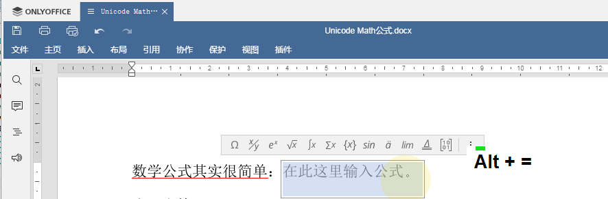
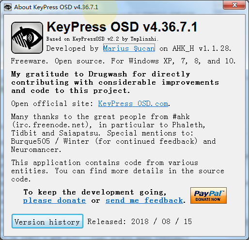

---
export_on_save:
  pandoc: chan
title: "如何使用UnicodeMath或LaTex在ONLYOFFICE中编写公式"
author: 天哥
date: Feb 24, 2023
output: word_document
---

# 如何使用UnicodeMath或LaTex在ONLYOFFICE中编写公式

在之前的文章中介绍了ONLYOFFICE最新更新的V7.3版本的新特性：

[TOC]

[ONLYOFFICE文档v7.3版本携新增功能发布了！](https://mp.weixin.qq.com/s?__biz=MzI2MjUyNzkyNw==&mid=2247503981&idx=1&sn=4bb426e8bf6b8d3e86d400a6b718797c&chksm=ea4b5eb5dd3cd7a39aa0eb23a06ca3a305c478d56c6481f0bca570cf77b3af7cc4b7e630e180#rd)

其中提到了新版本中增加了使用LaTex、UnicodeMath的方式编写公式的功能，这里就再进一步，如何编写公式。

数学公式可以编写的非常复杂，但是我们从最简单的地方入手，一步一步入门。

在需要新建公式的地方按键盘快捷键alt+=即可创建空白的公式，这个=号就是Backspace按键左边的按键，如上图所示，我特意安装了一款很小的工具软件：

它能把我所有键盘按键的操作完整的显示在桌面环境最顶层，方便在做复杂按键操作的视频或者截图中，清晰展示我的操作。

为什么要用这款工具，因为在Office软件里面用LaTex或UnicodeMath来编写数学公式，会节省很多鼠标在菜单里面寻找特殊字符、公式的操作，而是更多的是用键盘输入特定的字符串来生成数学公式，类似于我们Linuxer们的键盘常用习惯。

#参考文献

UTN28-PlainTextMath-v3.pdf