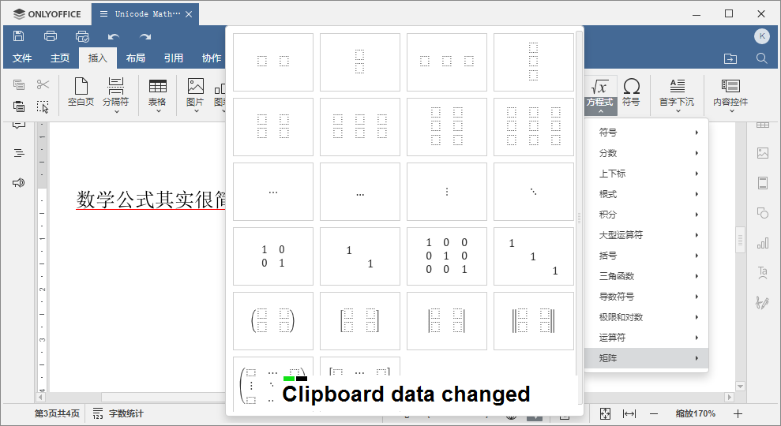

---
export_on_save:
  pandoc: chan
title: "如何使用UnicodeMath或LaTex在ONLYOFFICE中编写公式"
author: 天哥
date: Feb 24, 2023
output: word_document
---

# 如何使用UnicodeMath或LaTex在ONLYOFFICE中编写公式

在之前的文章中介绍了ONLYOFFICE最新更新的V7.3版本的新特性：

[TOC]

[ONLYOFFICE文档v7.3版本携新增功能发布了！](https://mp.weixin.qq.com/s?__biz=MzI2MjUyNzkyNw==&mid=2247503981&idx=1&sn=4bb426e8bf6b8d3e86d400a6b718797c&chksm=ea4b5eb5dd3cd7a39aa0eb23a06ca3a305c478d56c6481f0bca570cf77b3af7cc4b7e630e180#rd)

其中提到了新版本中增加了使用LaTex、UnicodeMath的方式编写公式的功能，这里就再进一步，如何编写公式。

数学公式可以编写的非常复杂，但是我们从最简单的地方入手，一步一步入门。

在需要新建公式的地方按键盘快捷键alt+=即可创建空白的公式，这个=号就是Backspace按键左边的按键，如上图所示，我特意安装了一款很小的工具软件：

它能把我所有键盘按键的操作完整的显示在桌面环境最顶层，方便在做复杂按键操作的视频或者截图中，清晰展示我的操作。

为什么要用这款工具，因为在Office软件里面用LaTex或UnicodeMath来编写数学公式，会节省很多鼠标在菜单里面寻找特殊字符、公式的操作，而是更多的是用键盘输入特定的字符串来生成数学公式，类似于我们Linuxer们的键盘常用习惯。

回到数学公式输入框，我们可以直接在里面输入：

这就是第一个公式，最简单的公式，别管它对不对，这只是一个工具，不负责纠正我们人类自己的错误，公式对不对完全取决于我们。输入完一个公式，鼠标点击公式框之外，或者按键盘上面的右键，将编辑光标移动到公式框右侧，就完成了这个公式框的编辑。

好了，现在你已经学会数学公式输入编辑了，可以自己去计算$log_2256$等于多少并把计算过程编写在ONLYOFFICE文档里面了，本文完，谢谢阅读！

没完！就正像是从1+1到$log_2256$一样，数学入门很简单，精通很难，从入门到精通有很漫长的努力学习的过程，

使用LaTex或UnicodeMath在ONLYOFFICE里面编写数学公式入门很简单，用到熟练也不是那么容易的，本文接下来才开始正文部分，不打算直接翻译英文手册，而是自己精心挑选了一些世界上最著名的数学、物理公式来作为例子，编写输入到ONLYOFFICE里面，讲解UnicodeMath、LaTex公式语法在公式编辑器中的使用。

## 0. 数学里面的HelloWorld

纠正一下上面自己示范的错误公式，正确的应该是这样的：

$$1=1$$

插入公式除了快捷键`alt+=`之外，也可以从顶端的Ribbon风格菜单栏的`插入`->`方程式`按钮创建：

直接点击大按钮是插入一个空白的公式，而点击下侧的向下的小三角符号，可以展开二级菜单，显示众多的公式类型，从中选择一个接近的数学公式来创建编辑：

#参考文献

UTN28-PlainTextMath-v3.pdf

[Why Some People Think 1=2](https://www.popularmechanics.com/science/math/a40587718/why-some-people-think-1-equals-2/)