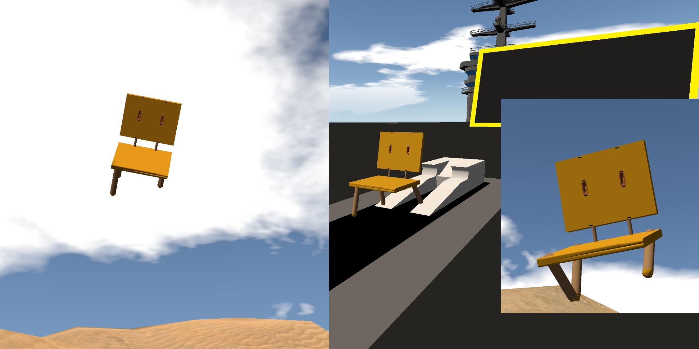
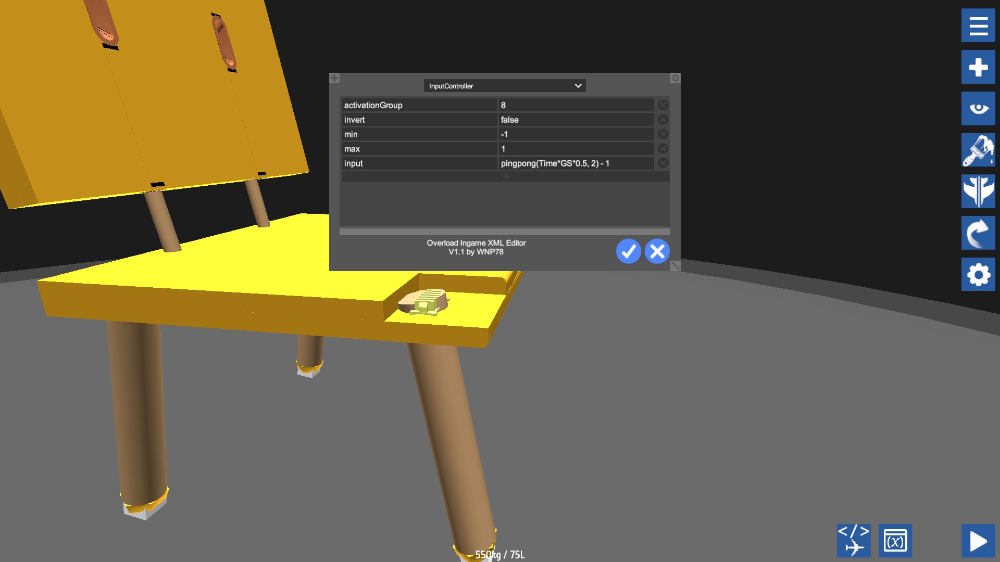
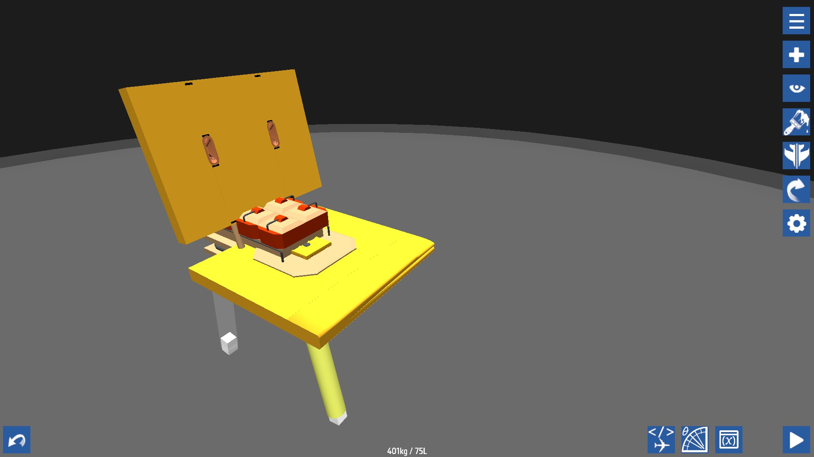

# Suzume Iwato's chair

# Suzume, Souta and the three-legged chair

Who is Suzume? Her!

This is a 2022 Japanese animated fantasy adventure film written and directed by Makoto Shinkai, produced by CoMix Wave Films, and distributed by Toho.

After watching it, I have an idea of modeling the chair of Suzeme in SimplePlanes, the figure of the chair is here,

And the director of the film has produced an actual chair, traveling with him all around the world,

So, since Makoto Shinkai could build an actual chair, I can build it in SimplePlanes too, here it is!

[Suzume Iwato's Chair(Soota Munakata)](https://www.simpleplanes.com/a/TM49R9/Suzume-Iwatos-ChairSota-Munakata-V-0-1)

# The operation

As you know, in the movie, the cat Daijin turns Souta into Suzume's chair, and so, the chair is alive, running, speaking as if it is a man. So does it in my SimplePlanes! you can push the throttle up to walk forward, yaw left and right, and pull the throttle down to come to a stop. It cannot fly! but you can jump up by activating 1, for only one time, this could help you jump up to the roof of some buildings in the terrain of SimplePlanes. One more thing, deactivate button 8 to let Sōta Munakata sleep and activate 8 to wake up without kissing. Here, you can see the three-legged chair will lie down when sleeping, it is unstable with only three legs. I have tried to add a jet to let the chair fly, but it is not so in the movie, so I throw the jet engine into the waste bin in the final.

# Real size

This is a real-size chair for a little girl like Suzume, to make it clear, I placed a pilot seat beside it, so, you can try to add more things to it, such as the key of Souta, and others. You can see the key hanging on the neck of the chair here,

# How?

Legs are driven by [funky tree programming](https://snowflake0s.github.io/funkyguide), you can see the code after you download this chair, the key function is the pingpong(), and a variable Time is an original signal, this makes the legs sway all the way unless it's asleep, walking fast when legs sway fast.

The movement is driven by a car engine embedded in it.

It looks like Suzeme is going to bomb the doors up into the sky with the bomb, but it is the car engine and is scaled small and embedded into the chair.

# BTW

the lost leg of her chair is [here](https://www.simpleplanes.com/a/yioQEn/The-lost-leg-of-Suzume-Iwatos-chair)