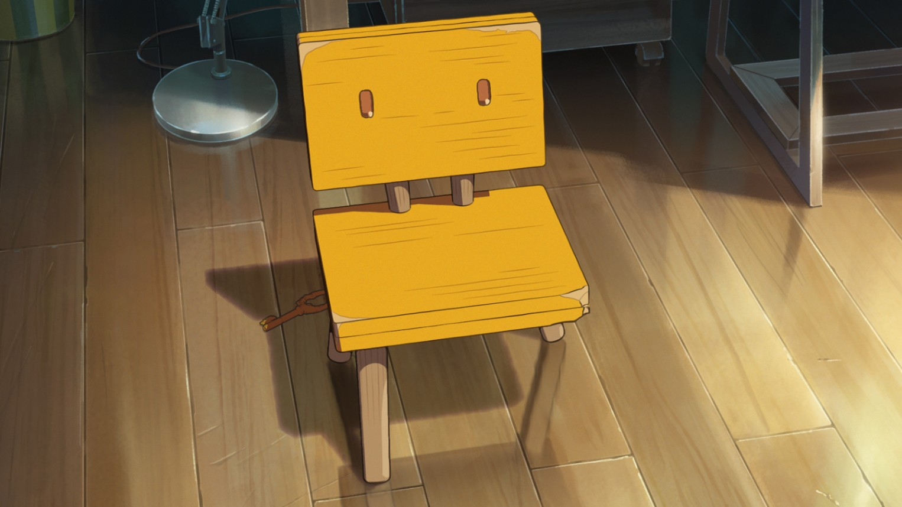
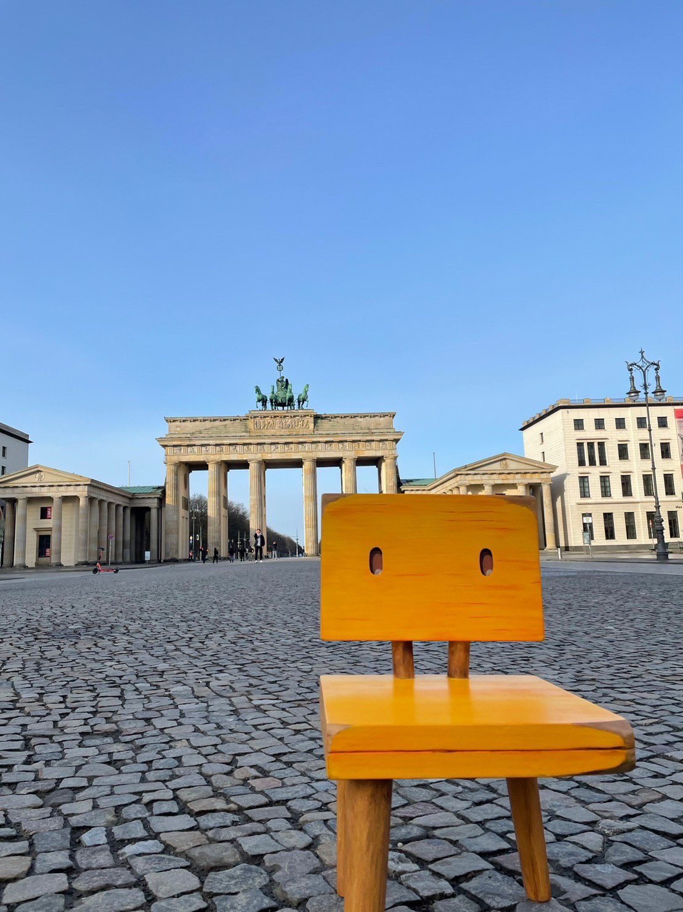
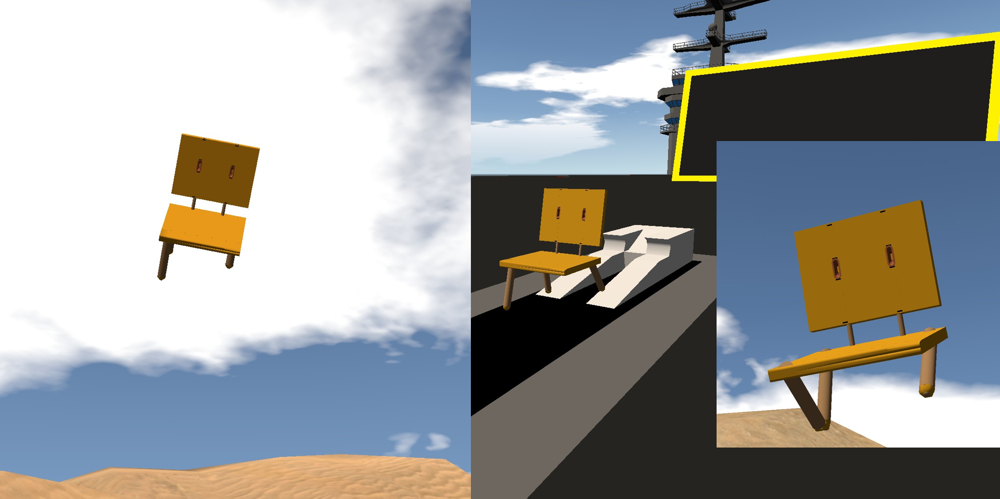
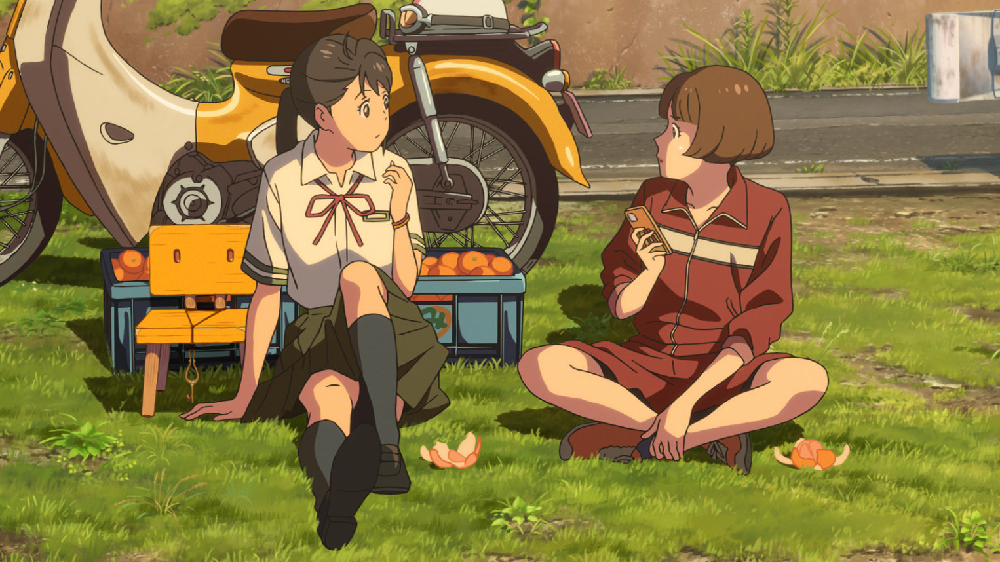
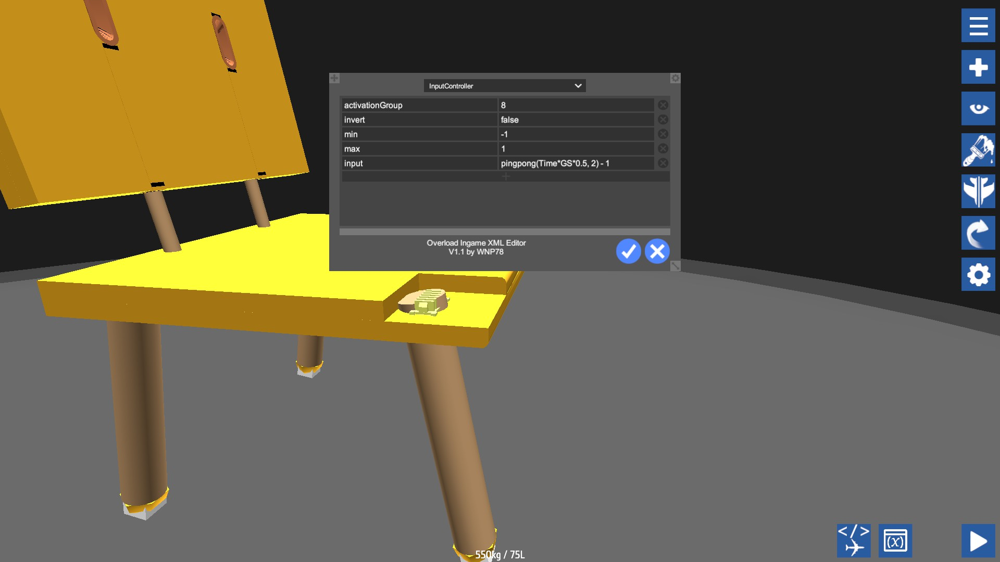
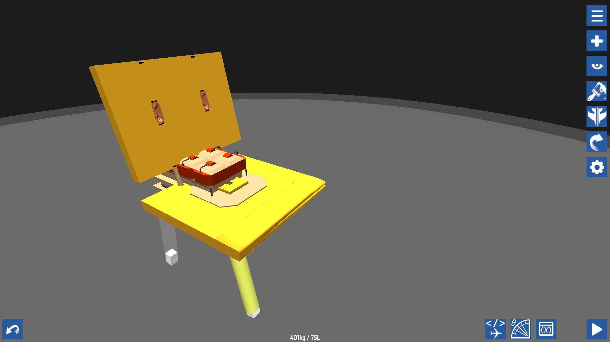

# 铃芽之椅

# 铃芽、草太、以及三腿椅

铃芽是谁？就是她！

去年2022年小日本新拍的一部动画片，新海诚导演的，片名叫做《铃芽之旅》，铃芽就是里面的女主角，在影片中，一个很重要的角色就是铃芽的椅子，这么简单的造型，怎么不可能在SimplePlanes里面建造出来呢？

该动画片的导演就亲自做了自己动画片的实物手办，这把椅子的现实复刻版，并且在日本之外巡回展演时候带上周游世界。

既然新海诚都可以在动画片之外的现实中制造这个动画片的角色道具，那么我也就能在SimplePlanes里面建模它并仿真它的运动！

[铃芽之椅](https://www.simpleplanes.com/a/TM49R9/Suzume-Iwatos-ChairSota-Munakata-V-0-1)

# 操作驾驶

在影片中，大臣，也就是那只白猫，用魔法施加咒语，将男主角草太变为他所坐着的椅子，也就是铃芽的小椅子，并且还是丢了一条腿的椅子，关键是被草太附体的三脚椅就活了，可以自己走自己跑，跑累了还就能睡的不省人事了，而我建模的这把椅子，你可以推高油门来向前行进，拉低油门来减速，左右蹬舵来左右转弯，基本操作一个不少，这把椅子不会飞！你只能按数字键1来跳跃，只限一次，比如跳跃到SP地景里面的一些楼房的房顶上。另外，按灭8就可以让草太睡觉了，按亮8就可以唤醒草太，而不需要你像影片里铃芽那样去亲吻这把椅子来唤醒他。这里你就能注意到在睡眠状态下，三条腿的椅子是站立不住的，一般都会倒下的，这和现实、影片中都是一样的。别猜了，我也试过加入飞机用的喷气发动机让它飞，但这毕竟不是影片中的设定，所以我最终还是忍痛割爱去掉了航发，只保留陆地上奔跑跳跃的能力，和影片保持一致。

# 真实尺寸

这个模型的是在SP世界观里面的真实尺寸的，为了佐证该点，我故意在铃芽之椅的旁边摆放了一把现代战机专用的弹射座椅，两相比较，铃芽之椅非常小，确实是专门给小女孩乘坐使用的，基于此，你还可以继续制作铃芽系列模型，比如草太的门钥匙，如下图中所示，椅子的脖子上悬挂着的就是这把钥匙。

# 如何实现的？

椅子腿的前后摆动使用[funky tree](https://snowflake0s.github.io/funkyguide)语言编程出来的，你可以下载模型后拆开来仔细看每一行代码，关键是使用了函数`pingpong()`、一个变量`Time`作为激励信号，这样，椅子腿就能一直摆动起来，除非草太睡着了，并且是摆动的越快走的越快，摆动的越慢走的越慢。

而运动本身是由汽车引擎驱动的

看起来就像，铃芽要把炸弹绑在椅子上，去把往门炸飞到天上去，而实际上只是把汽车发动机缩小，塞进椅子木板里面去隐藏起来。

# 彩蛋：

铃芽之椅丢掉的那一条腿在[这里](https://www.simpleplanes.com/a/yioQEn/The-lost-leg-of-Suzume-Iwatos-chair)。